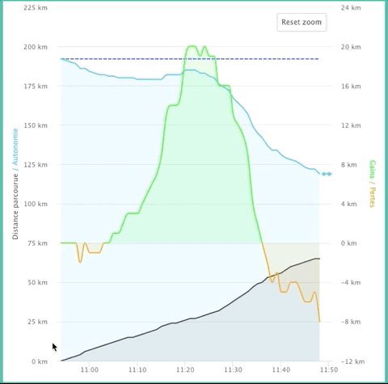
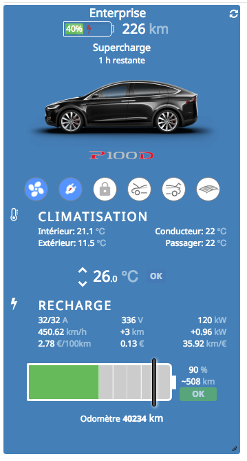
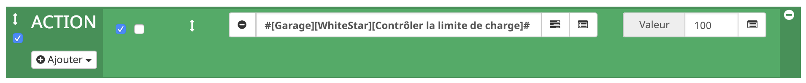
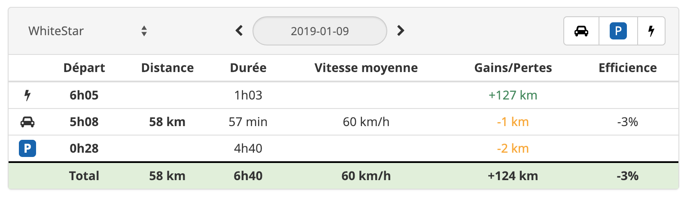

Introduction
===
Welcome to the documentation page of the Jeedom Tesla plugin ! 

Thanks to it, a Tesla owner can access to her/his car and interact with it, based on Tesla API.

Also, this plugin provides a panel to track all day long (or on demand) on a graph the range of your vehicle:




You want your car 90% charged at 7AM ? 
Create a scenario that will schedule the charge at the right time !

You will find the details of all versions in the [Change log](!https://vercorsio.github.io/jeedom-tesla-plugin/en_US/changelog).

Plugin setup
=======================

The setup is quite simple. Once downloaded, the user needs to activate it and follow below instruction to connect it to her/his car(s).


The plugin will retrieve all Tesla associated with your account and automagically create the corresponding Jeedom equipmenents.


> **Tip**
>
> This plugins requirs that your Tesla is online to properly work.
>
> First check that the Tesla app on your smartphone is able to connect to it.


User needs to check the following settings  `View the desktop panel` and `Show mobile panel` to have access to the **Range Tracking** panels:


The two methods to connect are::

### 1) With your owner's login informtaion (Tesla credentials):

- **Login** : Enter here the login of your Tesla account
- **Password** : Enter here your password
> **Note**
>
> Your credentials are only used for connexion phase to get an Access Token. 
>
> Given the Self Hosted features Jeedom is running on, your credential are only stored **locally** to the machine that ran your Jeedom.
> 
> However, you could want to remove email/password info after first sync, or keep them for the next time the plugin will require authentication (when Access Token expires).

### 2) With an Access Token:

- **Access Token** : Paste here an Access Token. If you have none, you can get one running the php code on your jeedom machine:

```
$ php /var/www/html/plugins/tesla/scripts/tokenTesla.php <login> <password>

Votre jeton d'accès à votre compte Tesla : 49329effb7d381c945fbf7e6b3e02691e746904f47ebdb2a3e54d49c93473e80
```
 
  
> **Note**
>
> Using this method will work until Access Token expires.
> A clic on 'revoke my access token' will clean up any security credentials associated with this authorization. It's like doing a log out on Tesla Servers.

After method 1 or method 2, you can click on  __"Synchronize my cars"__ button. Any cars that is not present as a Jeedom equipmenet will be created.

Virtual Teslas
--

If you want to test the plugin, or you don't have any Tesla (yet), you can create some virtual Teslas (__Model S__ et/ou __Model X__).

Fake cars will appear after clicking on __Add the virtual Teslas__ button. Some test data will be used to display different situations. Of course any action on these fake Teslas (heating/charging/locking) will have no effect.

Other config settings
--

- **Price for 1kWh** (euro) : Required to estimate the charging cost, the number of km you can do with 1euro and the price for 100km. The default value is `0.14`.
- **Tesla Client ID** et **Tesla Client Secret** : These public keys are required to access the Tesla Server. They are already filled but you may want to change them. 


Vehicle setup
=======================

Once the plugin is setup and the cars added, you can modify each of your cars: make it visible/enabled and attached to a Jeedom object (her the garage):


The `energy` mode on the  __Range Tracking__ requires some info about the battery:

 * __Capacité batterie__ : The capacity of the battery (kWh)
 * __Autonomie__ : How many km the car can do at 100% of charge 
 * __Consommation typique__ : In theroy, it is `Capacité batterie X 1000 / Autonomie`. Can be updated according to usage.
 * __Affichage__ : The default display. Choices are: `Energie` or `Distance`. 


Info and action commands associated to each Tesla are the following:


Commands  **info**
--

| Command   |   Description |
| --- | --- |
| **Photo** | Display a picture of the Tesla.
| **Info awake** | Tells whether the car is asleep (0) or online (1).
| **Info ideal range** | Provide the ideal range (km or miles).
| **Info rated range** | Provide the rated range (km or miles).
| **Info range** | Provide the range in km or miles.
| **Info HVAC** | Tells whether the HVAC is on or off.
| **Info interior temp** | Provide temperature inside the car.
| **Info charging** | Tells if the car is currently charging or not. Possible values are  { `Charging`, `Stopped`, `Disconnected`, `Complete`, `Scheduled`, `Driving` }.
| **Info battery level** | provide battery level (%).
| **Info charging limit** | Provide value of charging limit (%).
| **Info lock** | Tells whether the car is locked or not.
| **Info frunk** | Tells whether the frunk is locked or not.
| **Info trunk** | Tells whether the trunk is open or not.
| **Info sunroof** | Tells whether the sunroof is open or not.
| **Info heure de départ de recharge** | Tells when the charging needs to start (`Hmm` format).
| **Info heure de fin de recharge** | Tells when the charging shall end  (`Hmm` format).
| **Odometer** | Provide value of odometer (km/miles).
| **Info car** | Display info (title and subtitle) about current. Example _Driving 68km/h_, _Charging scheduled at 22h50_, _Parked_, _Supercharge_, ...
| **Range details** | Display a battery graph.
| **Charging details** | Display details about the charging.
| **HVAC details** | Display details about HVAC (driver, passenger, inside and outside 
| **Data details** | `For debugging purpose` - display a 64bits encoded buffer of the output of the car minus any personally identifiable info (VIN/id/GPS/...).  

temperatures). 

Commands **action**
--

| Command   |   Description |
| --- | --- |
| **Control charging** | Start/stop/estimate charging when cable is engaged.
| **Control the charging limit** | Set the charging limit (%).
| **Control HVAC** | Start/stop HVAC.
| **Control temperatures** | Set temperatures for driver and passenger.
| **Control lock** | Lock/unlock the car doors.
| **Control the frunk** | Lock/unlock the frunk.
| **Control the trunk** | Lock/unlock the trunk.
| **Control the sunroof** | Lock/unlock the sunroof.
| **Contrôler l'heure de fin de recharge** | Set the time when the charging shall stop (format `Hmm`).
| **Control the range tracking** | Start/stop the range tracking.
| **Refresh** | Refresh the jeedom panel.
| **Wake up** | Try (3 times with 5 sec between two attempts) to wake up the car. May be usefull in context of a scenario. Automatically update the value of **Info awake**.

> **Tip**
>
> Each of these actions can be used in Jeedom scenarios.


Car display
=======================

Most of the listed commands has a specific template. The default presentation for a car is as follow : :

### Desktop version:



### Mobile version:


For example, if user does not want to display the picture and HVAC details, he/she needs to uncheck the `"Display"` toggle in car settings.

By default, the odometer is historised. This can be useful to display a graph of past km.

Control HVAC
--

| Button | Description | A clic on this bouton will ... | 
| --- | --- | --: |
|  | HVAC is stopped | _... start HVAC_ | 
|  | HVAC is started | _... stop HVAC_ |

User can set the driver and passenger temperature using a specific widget, described in following animation:


> **Note**
>
> Due to a limitation in the current version of the Tesla API, we can set different temperatures to driver and passenger only if SYNC is unselected in the car.
>

Control locks, trunks and sunroof
--

| Button | Description | A clic on this bouton will ... |
| --- | --- | --: |
|  | The car is locked | _... unlock the doors_ |
|  | The car is unlocked | _... lock the doors_ |
|  | The front trunk is closed | _... unlock the frunk_ |
|  | The front trunk is open | _...  have no effect_ |
|  | The rear trunk is closed | _... unlock the trunk_ |
|  | The rear trunk is open | _...  close the trunk_ |
|  | The sunroof is closed | _... slightly open the sunroof_ |
|  | The sunroof is open | _...  close the sunroof_ |

Control the charging
--

| Button | Description | A clic on this bouton will ... |
| --- | --- | ---: |
|  | The charging cable is not engaged | _... have no effect_
|  | The charging is scheduled | _... start the charging_
|  | The charging is running | _... stop the charging_
|  | The charging has been manually stopped | _... resume the charging_
|  | The charging is complete | ... _have no effect_
|  | The charging state is unknown | ... _have no effect_
 
Controle the range tracking
--

| Bouton | Description |  A clic on this bouton will ... |
| --- | --- | ---: |
|  | The range tracking is stopped | _... start the range tracking _
|  | The range tracking is running | _... stop the range tracking _


User can set the charging limit using a specific widget, as described in following animation:


Scenario
==

Scenario examples:
* Set the charging limit to 100%:
  

* Once the car is online, set charge limit to 90% and set temp to 23°C and starts HVAC if inside temp is lower than 14°C:

  


* Set the charging start time to have **90%** charged at **7AM** !
  

> **Note** 
>
> To return the specific starting time, a small charging needs to be ran. During it the charging estimates will be provided. 
>
> If the car is not ready for charging, the command **Info heure de départ de recharge** returns `N/A`. 
>
> If the charging duration is smaller than the difference between now and the charging end time, the command **Info heure de départ de recharge** returns the starting time (format `Hmm`) when charging can be scheduled.
>
>Otherwise the command **Info heure de départ de recharge** returns the starting time prefixed with `-`.
>
> Examples: we want to have car **90%** charged at **7AM**:
> - It is 10:30PM when the scenario is launched. The charging duration is estimated to **5 hours and 30 minutes**. The command **Info heure de départ de recharge** returns `130` (i.e: start the charging at 1:30AM)).
> - It is 10:30PM when the scenario is launched. The charging duration is estimated to **12 hours**. The command **Info heure de départ de recharge** returns `-1900`  (i.e: start the charging at 7PM, but it's too late !)
> - It is 10:30PM when the scenario is launched, but the car is not plugged. The command **Info heure de départ de recharge** returns `N/A`.

Range tracking
==


The `Range Tracking` panel provides all required info to the driver to help her/him understand how range or energy evolves when she/he is driving the car. All enabled Teslas configured in Jeedom can be tracked.

This tool retrieves data from Tesla servers via a cron job that is manually started/stopped from the panel. It provides statistics on each steps : **driving**, **charging** and **parking**. All retrieved data is stored on the **local** drive of your Jeedom server.

A calendar allows user to display graphs from a specific day.

> **Tips**
>
> * The mobile version of the panel can be used while driving : a live mechanism updates the graph when new data arrives !
>
> * To automagically display the `Tesla` view on Mobile version, you can define `Tesla` as the default `Mobile` view in Jeedom profile configuration : `User menu` -> `Admin Profil` -> `Interface tab`.
>
> * The range tracking can be programmatically started and stopped thru scenarios

Setup
--
By default, the cron job is not started.

When user clics on `Start Recording` button, the cron job retrieves data every minute. These data will be used to create the graphs and will calculate statistics.

When user clics on `Stop Recording` button, the cron job stops all data retrieval. You can still display recorded graphs but the activity with Tesla Server is donw.

> **Notes**
>
> When recording is started and displayed graph is the graph of the day, the panel displays `live` data that are updated on the fly.
>
> At first launch, it may takes several minutes before first points appear on the graph.

Example __Distance__
--
The example below corresponds to a real trip made on 2019, January the 5th. This trip is mainly split in 4 stages: 
- <code>km  0</code> to <code>km 15</code>: road - _altitude: from 1100m to 1000m_. 
- <code>km 15</code> to <code>km 30</code>: road - _altitude: from 1000m to 250m_.
- <code>km 30</code> to <code>km 50</code>: highway - _altitude: from 250m to 400m_.
- <code>km 50</code> to <code>km 65</code>: road - _altitude: from 400m to 500m_.


- Horizontal axis is timeline.
- The left vertical axis represents:
   - the traveled milleage in <b>black</b>,  <u>Note:</u> the more the curve goes up, the faster the speed.
   - the range at the beginning of the trip in <b style="color:#3355FF">dashed</b>
   - the current evolution in <b style='color:#22C4FF'>blue</b>.
   - When the HVAC is on, the curve turns to <b style='color:blueviolet'>violet</b>.
- The right vertical axis represents:
   - the difference between the <b style="color:#3355FF">range at the beginning of the trip</b> and the <b style='color:#22C4FF'>current range</b> without <b>mileage traveled</b> removed. The curve is <b style="color:#00FF00">green</b> when there is a gain, and <b style="color:#FFA500">orange</b> when we observe a loss.
   - the value of the <b style="color:#E74C3C">charger power</b> when the car is charging 


The table below lists all the different stages of the day. User can clic a specific stage to zoom the graph. A clic on the footer resets the zoom and displays the whole day.



- The `efficiency` corresponds to the ratio between the gain/loss and the traveled mileage. In general small trips have bad efficency.
- The 3 buttons on the top right of the table allow the user to filter the table. For example she/he can display only the parking stages to see how range evolves when car is not moving (_vampire drain_) 


Example __energy__
--
Since version `1.5.0`, user can switch from `distance` mode to `energy` mode clicking on the slider in the table.
In this mode, the <b style="color:#00FF00">green</b>/<b style="color:#FFA500">orange</b> curve is replaced by another one that describes the energy consumption, with three zones:
 * <b style="color:#FF0000">overconsumption</b> when energy is greater than typical range (here `220Wh/km`) ,
 * <b style="color:#FFA500">underconsumption</b>
 * <b style="color:#00FF00">production</b> when accumulated energy is negative.


The table describe info about energy:  in <b style="color:darkgreen">green</b> when average consumption of the trip was lower than typical range and <b style="color:#FF0000">red</b> otherwise.

> **Notes**
>
> - You can avoid unintentional energy consumption by minimizing the range tracking. Keep it off when it is not needed (on nights or during long parking times)

FAQ:
==

1. How do I upgrade my equipment after a plugin upgrade ?

   At plugin upgrade, the plugin automatically synchronizes your car(s). However, it might not properly work (car not available for example), thus you simply need to click on `Synchronize my cars` button and the new Info and Action commands will be added to your vehicle and available on the dashboard.

2. How do I switch from °C to °F, or km to miles ?
   The Jeedom plugin reads the settings you made in your own car and displays temperatures, distance based on units sent by your car.

   Also the choice to display rated range or ideal range is following the car settings

3. The 'wake up' action does not wake up the car.
  
   In the plugin configuration panel you can change the two following settings `Number of attempts to wakeup the car` and `Number of seconds between two attempts` to force the wake up. The `Wake up` action does better work when **Always connected** mode is activated in your car.


Please send any question trouble you have to <a href='mailto:vercors.io@gmail.com?subject=About%20Jeedom%20Tesla%20plugin...'>vercors.io@gmail.com</a> !
