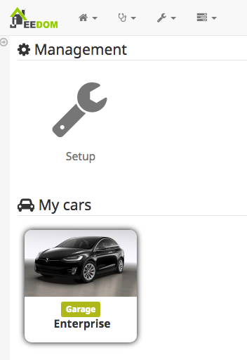
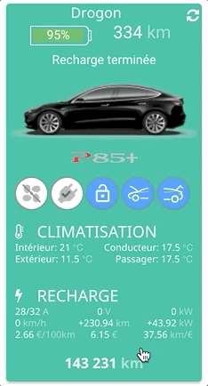
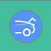
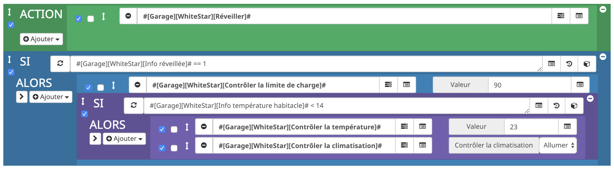

Introduction
===
Welcome to the documentation page of the Jeedom Tesla plugin ! 

Thanks to it, a Tesla owner can access to her/his car and interact with it, based on Tesla API.

You will find the details of all versions in the [Change log](!https://vercorsio.github.io/jeedom-tesla-plugin/en_US/changelog).

Plugin setup
=======================

The setup is quite simple. Once downloaded, the user needs to activate it and follow below instruction to connect it to her/his car(s).


The plugin will retrieve all Tesla associated with your account and automagically create the corresponding Jeedom equipmenents.


> **Tip**
>
> This plugins requirs that your Tesla is online to properly work.
>
> First check that the Tesla app on your smartphone is able to connect to it.


The two methods to connect are::

### 1) With your owner's login informtaion (Tesla credentials):

- **Login** : Enter here the login of your Tesla account
- **Password** : Enter here your password
> **Note**
>
> Your credentials are only used for connexion phase to get an Access Token. 
>
> Given the Self Hosted features Jeedom is running on, your credential are only stored **locally** to the machine that ran your Jeedom.
> 
> However, you could want to remove email/password info after first sync, or keep them for the next time the plugin will require authentication (when Access Token expires).

### 2) With an Access Token:

- **Access Token** : Paste here an Access Token. If you have none, you can get one running the php code on your jeedom machine:

```
$ php /var/www/html/plugins/tesla/scripts/tokenTesla.php <login> <password>

Votre jeton d'accès à votre compte Tesla : 49329effb7d381c945fbf7e6b3e02691e746904f47ebdb2a3e54d49c93473e80
```
 
  
> **Note**
>
> Using this method will work until Access Token expires.
> A clic on 'revoke my access token' will clean up any security credentials associated with this authorization. It's like doing a log out on Tesla Servers.

After method 1 or method 2, you can click on  __"Synchronize my cars"__ button. Any cars that is not present as a Jeedom equipmenet will be created.

Virtual Teslas
--

If you want to test the plugin, or you don't have any Tesla (yet), you can create some virtual Teslas (__Model S__ et/ou __Model X__).

Fake cars will appear after clicking on __Add the virtual Teslas__ button. Some test data will be used to display different situations. Of course any action on these fake Teslas (heating/charging/locking) will have no effect.

Other config settings
--

- **Price for 1kWh** (euro) : Required to estimate the charging cost, the number of km you can do with 1euro and the price for 100km. The default value is `0.14`.
- **Tesla Client ID** et **Tesla Client Secret** : These public keys are required to access the Tesla Server. They are already filled but you may want to change them. 


Vehicle setup
=======================

Once the plugin is setup and the cars added, you can modify each of your cars: make it visible/enabled and attached to a Jeedom object (her the garage):




Les commandes d'info et d'action associées à chaque Tesla sont les suivantes


Commands  **info**
--

| Command   |   Description |
| --- | --- |
| **Photo** | Display a picture of the Tesla.
| **Info awake** | Tells whether the car is asleep (0) or online (1).
| **Info ideal range** | Provide the ideal range (km or miles).
| **Info rated range** | Provide the rated range (km or miles).
| **Info range** | Provide the range in km or miles.
| **Info HVAC** | Tells whether the HVAC is on or off.
| **Info interior temp** | Provide temperature inside the car.
| **Info charging** | Tells if the car is currently charging or not. Possible values are  { `Charging`, `Stopped`, `Disconnected`, `Complete`, `Scheduled` }.
| **Info charging limit** | Provide value of charging limit (%).
| **Info lock** | Tells whether the car is locked or not.
| **Info frunk** | Tells whether the frunk is locked or not.
| **Info trunk** | Tells whether the trunk is open or not.
| **Info sunroof** | Tells whether the sunroof is open or not.
| **Odometer** | Provide value of odometer (km).
| **Info car** | Display info (title and subtitle) about current. Exemple _Driving 68km/h_, _Charging scheduled at 22h50_, _Parked_, _Supercharge_, ...
| **Range details** | Risplay a battery graph.
| **Charging details** | Risplay details about the charging.
| **HVAC details** | Display details about HVAC (driver, passenger, inside and outside temperatures). 

Commands **action**
--

| Command   |   Description |
| --- | --- |
| **Control charging** | Start/stop charging when cable is engaged.
| **Control the charging limit** | Set the charging limit (%).
| **Control HVAC** | Start/stop HVAC.
| **Control temperatures** | Set temperatures for driver and passenger.
| **Control lock** | Lock/unlock the car doors.
| **Control the frunk** | Lock/unlock the frunk.
| **Control the trunk** | Lock/unlock the trunk.
| **Control the sunroof** | Lock/unlock the sunroof.
| **Refresh** | Refresh the jeedom panel.
| **Wake up** | Try (3 times with 5 sec between two attempts) to wake up the car. May be usefull in context of a scenario. Automatically update the value of **Info awake**.

> **Tip**
>
> Each of these actions can be used in Jeedom scenarios.


Car display
=======================

Most of the listed commands has a specific template. The default presentation for a car is as follow : :

### Desktop version:


### Mobile version:




For example, if user does not want to display the picture and HVAC details, he/she needs to uncheck the `"Display"` toggle in car settings.

By default, the odometer is historised. This can be useful to display a graph of past km.

Control HVAC
--

| Button | Description | A clic on this bouton will ... | 
| --- | --- | --: |
|  | HVAC is stopped | _... start HVAC_ | 
|  | HVAC is started | _... stop HVAC_ |

User can set the driver and passenger temperature using a specific widget, described in following animation:


> **Note**
>
> Due to a limitation in the current version of the Tesla API, we can set different temperatures to driver and passenger only if SYNC is unselected in the car.
>

Control locks, trunks and sunroof
--

| Button | Description | An clic on this bouton will ... |
| --- | --- | --: |
|  | The car is locked | _... unlock the doors_ |
|  | The car is unlocked | _... lock the doors_ |
|  | The front trunk is closed | _... unlock the frunk_ |
|  | The front trunk is open | _...  have no effect_ |
|  | The rear trunk is closed | _... unlock the trunk_ |
|  | The rear trunk is open | _...  close the trunk_ |
|  | The sunroof is closed | _... slightly open the sunroof_ |
|  | The sunroof is open | _...  close the sunroof_ |

Control the charging
--

| Button | Description | An clic on this bouton will ... |
| --- | --- | ---: |
|  | The charging cable is not engaged | _... have no effect_
|  | The charging is scheduled | _... start the charging_
|  | The charging is running | _... stop the charging_
|  | The charging has been manually stopped | _... resume the charging_
|  | The charging is complete | ... _have no effect_
|  | The charging state is unknown | ... _have no effect_
 


User can set the charging limit using a specific widget, as described in following animation:


Scenario
==

Scenario examples:
* Set the charging limit to 100%:
  

* Once the car is online, set charge limit to 90% and set temp to 23°C and starts HVAC if inside temp is lower than 14°C:

  


FAQ:
==

1. How do I upgrade my equipment after a plugin upgrade ?

   At plugin upgrade, the plugin automatically synchronizes your car(s). However, it might not properly work (car not available for example), thus you simply need to click on `Synchronize my cars` button and the new Info and Action commands will be added to your vehicle and available on the dashboard.

2. How do I switch from °C to °F, or km to miles ?
   The Jeedom plugin reads the settings you made in your own car and displays temperatures, distance based on units sent by your car.

   Also the choice to display rated range or ideal range is following the car settings

3. The 'wake up' action does not wake up the car.
  
   In the plugin configuration panel you can change the two following settings `Number of attempts to wakeup the car` and `Number of seconds between two attempts` to force the wake up. The `Wake up` action does better work when **Always connected** mode is activated in your car.
----


Please send any question trouble you have to <a href='mailto:vercors.io@gmail.com?subject=About%20Jeedom%20Tesla%20plugin...'>vercors.io@gmail.com</a> !
