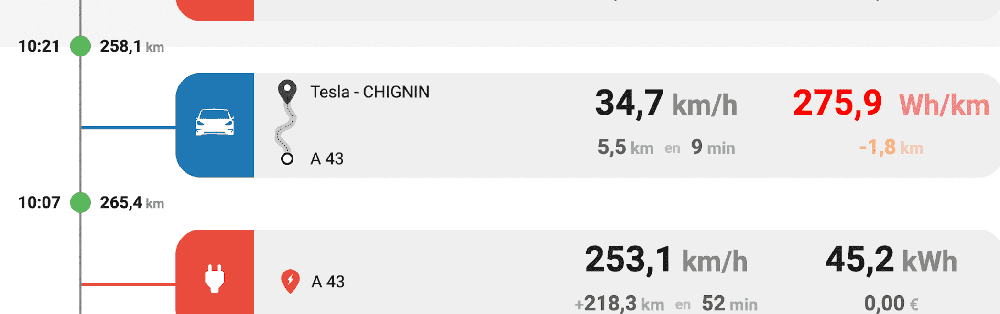
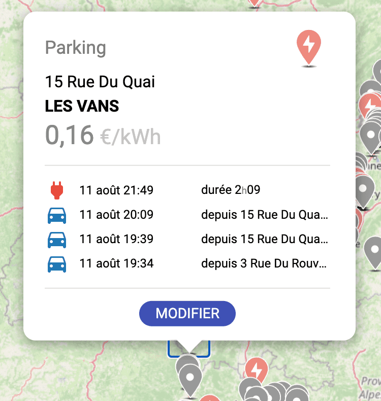
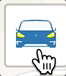
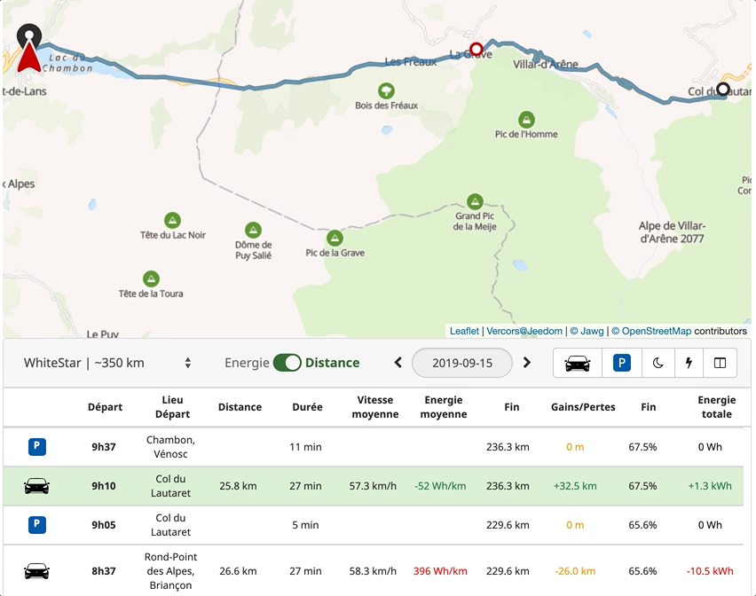
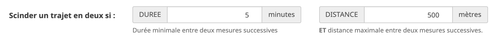
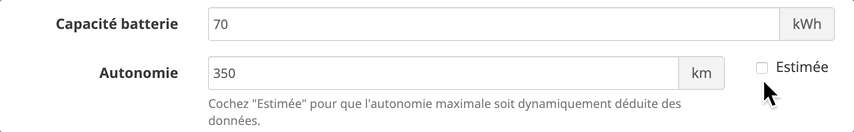
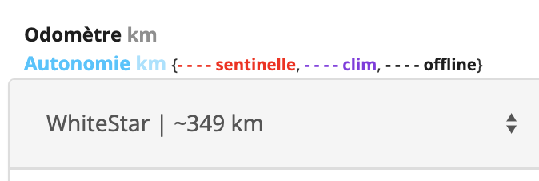
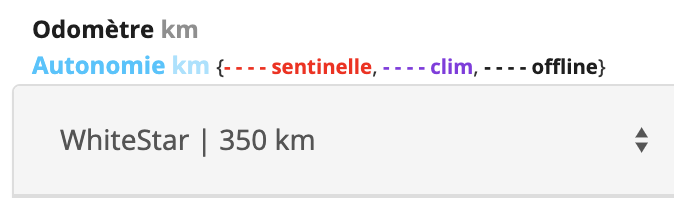

# 3.1.10-beta.158.142 (2023-04-11)

### Améliorations
 - Dans la barre du haut du Tracking : Quand les données du jour sont affichées un clic sur le km restants affiche le % restant.
 - Ajout des données `Info longitude`, `Info latitude` et `Info date de géolocalisation` qui sont mises à jour quand la voiture est à l'arrêt

### Correctif
 - Meilleure prise en charge de la seconde Tesla inscrite sur jeedom (merci à `Sattaz`).
 - Le graph de la consommation ne se rafraichissait pas quand on passait d'une tesla à l'autre. Corrigé.

# 3.1.9 (2023-02-20)

### Correctif
 - Le tracking avait une facheuse tendance à ne pas se démarrer correctement, plus particulièrement lors des mise à jour. Corrigé 

# 3.1.8 (2023-02-17)

### Correctif
 - [Carte] Un markeur sans nom de ville peut provoquer une erreur lors de son édition. Corrigé

 

# 3.1.6 (2023-02-01)

### Amélioration
 - Dans la barre du haut du Tracking : 
   * Affichage de l'indication de chauffe du siège conducteur et/ou passager.
   * L'icone d'alerte "pneu dégonflé" est déplacée à droite 

### Correctif
 - Lors de la mise à jour, quand la voiture est en veille et tarde à se réveiller, un bug peut empêcher le démon du tracking de se démarrer. Corrigé.

# 3.1.5 (2023-01-25)

### Amélioration
 - Changement du logo du plugin. Il arbore maintenant la face avant d'une Model 3.
 - Dans la barre du haut du Tracking : 
   * Affichage de la température si elle est inférieure à 5°C.
   * Indication de l'activation du chauffage et/ou du dégivrage avant/arrière.
   * Affichage d'une icone qui indique si un ou plusieurs pneus nécessitent un regonflage (en orange si fable perte, rouge si forte perte).
 - Homogénisation des icones affichées (dans le pur style Tesla).
### Correctif
 - Le démon du tracking pouvait bagotter après une mise à jour du plugin. Corrigé
 - Correctif de l'affichage du graph de consommation lors du roulage.
 - Une seconde tentative de réveil de la voiture pouvait échouer. Corrigé.

# 3.1.4 (2023-01-18)

### Amélioration
 - Récupération de toutes les journées où le plugin détient des données de tracking, pour un affichage correct du calendrier.
 - Meilleure gestion de la lecture et l'écriture des fichiers. En cas de problème un message clair est indiqué dans les logs.
 - Amélioration de l'affichage de la liste des favoris sur la carte (ajout de la ville, tri par ville, possibilité d'affichier cacher les favoris de parking et/ou les favoris de lieux de recharge)
 
### Correctif
 - Au redémarrage du démon, la date de début du stationnement est inconnue, L'affichage folklorique "_Stationnée depuis 52 ans 11 mois_" est simplement remplacé par "_Stationée_"...
 - Correction d'un problème introduit en 3.1.3 qui pouvais empecher le tracking de s'activer (merci à `BroLee` et `DrFlowW` ! )

# 3.1.3 (2023-01-09)

### Amélioration
 - Ajout d'un bouton sur la carte pour accéder à la liste des favoris. Il devient possible de déplacer un favoris pour ajuster sa position.

### Correctif
 - Ouverture et fermeture du port de charge. A l'ouverture le port de charge est déverrouillé. Il se verrouille au bout de quelques instants. Corrigé
 - Synchronisation de l'état du mode Sentinelle. Corrigé

# 3.1.2 (2022-12-09)

### Améliorations
 - Ajout de la version et d'un lien vers le changelog dans le panneau principal de configuration du plugin.
 - Le bouton "Documentation" navigue maintenant vers http://tesla.jeedom.free.fr/documentation

### Correctif
 - Quand la voiture se trouve dans un fuseau horaire différent de celui de Jeedom, le tracking affiche des dates et durées erronnées. Corrigé

# 3.1.1 (2022-12-05)

### Correctif
 - A la première connexion, les jetons d'authentification n'étaient pas correctement enregistrés. Corrigé

# 3.1.0 (2022-12-04)

### Nouveautés

#### Feuille de Route
 

- le tableau des trajets adopte un nouveau visuel : **la Feuille de Route**. Plus claire et plus synthétique, elle met l'accent sur les trajets et les charges de la journée représentés par des panneaux accrochés à une chronologie située à la gauche de l'écran. On retrouve sur chaque panneau la vitesse de conduite ou de charge, la durée de l'étape, la consommation d'énérgie, ... Dans ce visuel, les parkings et temps de veille ne sont pas affichés. 
- Lors de la conduite, si un trajet est programmé dans la Tesla, un panneau supplémentaire s'affiche et indique la destination, l'heure estimée d'arrivée et le kilométrage à l'arrivée.
- L'ancien mode d'affichage en tableau reste disponible. Il suffit de cliquer sur "Détails" eu haut à droite de la "Feuille de Route"
- Simplification du filtrage des étapes : quatre boutons "Conduite", "Charge", "Parking" et "Veille" sont visibles en haut à droite de la feuille de route pour ajouter/enlever des types de trajets. "Parking" et "Veille" ne sont disponibles que lorsque le tableau passe en mode "Détail".  

#### Carte
- La carte contient un nouveau bouton qui permet de voir l'intégralité des trajets effectués sur la journée affichée.
- Lorsque l'on passe le pointeur de la souris sur un trajet, le tracé sur la carte est mis en évidence. Un clic sur la ligne permet de zoomer sur le tracé en question.
- Lorsqu'on clique sur un marqueur de la carte (parking ou favoris) le popup affiche désormais les 5 derniers passages ou recharges à cet endroit. 

 

- Ajout d'un mode qui permet de zoomer sur le trajet en cours. Des clics successifs sur le bouton situé en haut à droite de la carte, permettent de passer du zoom sur la voiture, au zoom sur le trajets en cours, puis au zoom de tous les trajets de la journée.

 

#### Divers
- Le kiométrage ou % restant dans la barre du haut du tracking devient clickable si le jour affiché n'est pas le jour courant. Un clic sur ce chiffre est un raccourci pour afficher le tracking "d'aujourd'hui".
- Un bouton "Regénérer le Widget" est disponible dans la configuration du véhicule pour remettre le widget dans son état initial. Il permet également de compléter les commandes manquantes (introduites lors d'une mise à jour du plugin, par exemple, ...)

### Correctif
 - Le bouton du tracking du widget a été repensé. Il est maintenant lié a "Info mode du tracking".
 - Les informations affichées dans le widget correspondent maintenant aux dernières données remontées par le tracking (merci à `vince_007` et `lcd91` pour leurs tests ! ).

# 3.0.16 (2022-11-10)

### Améliorations
 - Performances : Optimisation et simplification des requètes pour améliorer l'expérience utilisateur

# 3.0.14 (2022-10-27)

### Améliorations
 - **Tableau des trajets** : Les choix de type de trajets visibles sur le tableau sont mémorisés (parking/driving/sleeping/charging).
 - **Carte** : Ajout d'un style de carte : OpenStreetMap, avec mémorisation du choix de carte choisie. Bouton plus gros sur grands écrans. Meilleure prise en charge du thème noir.
 - **Statistiques** : Ajout de la vitesse et de l'energie produite/consommée lors de la conduite. Ajout de la vitesse de charge. Ajout des températures extérieure et habitacle.
 - **Page de démarrage** : Revue du chargement de la page, avec fond rouge :)
 - **Graphique** : Redesign de la légende. La légende n'est plus affichable sur petits écrans. 
 - **Multi Tesla** : Meilleure prise en charge lorsque plusieurs Tesla sont déclarées sous Jeedom.
 - **Base de données** : Optimisation et suppression des lignes orphelines.
 - **Statistiques** : Le panel des statistiques du jour peut être glissé vers le haut.
 - **Performances** : Amélioration du code pour réduire les temps de chargement des données et accélerer l'affichage. 

### Correctifs
 - **Démon du tracking** : Redémarrage du tracking s'il a été démarré il y a plus de 5 heures et lorsqu'il est en échec. 
 - Lorsque une voiture n'a pas de nom, le plugin refusait son inscription. Maintenant un nom par défaut *"Sans nom"* est utilisé pour permettre son intégration dans Jeedom.
 - Le tracking est redémarré après mise à jour du plugin.

> Note :
>
> Les noms des fichiers de tracking sont renommés lors de la mise à jour de cette version. Le VIN est maintenant utilisé dans le nom du fichier.

# 3.0.13 (2022-09-24)

### Améliorations
 - Petites améliorations visuelles sur le tracking. 

# 3.0.12 (2022-08-06)

### Correctif
 - Certains trajets n'étaient pas pris en compte (sortie de veille à début de conduite, ...). Corrigé

# 3.0.11 (2022-07-06)

### Correctif
 - La table des trajets pouvait être vide. Corrigé

# 3.0.10 (2022-06-29)

### Améliorations
 - Suppression du bouton pour synchroniser les voitures
 - A la connexion, le plugin scan automatiquement les véhicules associés au compte tesla.com et les rend disponibles à l'ajout dans Jeedom
 - Dans le cas d'une installation sur un jeedom 4.2, les tuiles de la carte du tracking peuvent ne pas s'afficher. Une solution de contournement est proposée et affichée après le clic sur l'icone ambulance.
 
### Correctif
 - 
 - Suite aux nouvelles règles de sécurité intoduites depuis Jeedom 4.2, les images issues du configurateur tesla peuvent provoquer un freeze.
 - Un jeu d'images statiques (1 de chaque pour les 5 couleurs des 4 modèles Tesla) est proposé. L'utilisateur choisit la couleur dans la configuration du véhicule

> Note
>
> La possibilité d'uploader une image pour remplacer celle par défaut a été temporairement retiré
> Suppression des 3 autres images (3/4, intérieur, arrière)

 

# 3.0.9 (2022-04-12)

### Améliorations
 - Ajustement des données affichées sur le rapport de santé

# 3.0.8 (2022-04-05)

### Améliorations
 - La valeur par défaut du cout du kWh passe de 0.14 à 0.18

### Correctif
 - Force le rafraichissement du toekn avant qu'il n'expire.

# 3.0.7 (2022-04-05)

### Améliorations
 - Alignement de la gestion des tokens d'authentification suite aux modification d'API tesla.

# 3.0.6 (2022-03-30)

### Correctifs
 - Correctif lié à la base - consolidation des booleans favoris et charge.
 - Meilleurs prise en charge des erreurs remontées par la base de données 

> Notes
 - Version 3.0.3, 3.0.4 et 3.0.5 : corrections mineures

# 3.0.2 (2022-03-08)

### Correctif
 - L'indication de vitesse est corrigée

# 3.0.1 (2022-03-01)

### Correctif
 - Le widget pouvait clignoter au rechargement. Corrigé

# 3.0.0 (2022-02-28)
### Highlights
- Passage en stable de la version 3.0.0
- Retrouvez l'ensemble des améliorations introduites avec la version 3 au fil des différentes versions beta.
- Merci à tous les testeurs, à vos retours, à votre patience

> Notes:
> 
> La version 2.3 du plugin Tesla n'est pas compatible avec la version 4.2 de Jeedom sortie le 31 janvier. 

# 3.0.0-beta.51.45 (2022-01-31)
### Correctifs
- Des trajets pouvaient ne pas se charger ou être incomplets. Corrigé
- Le widget pouvait ne pas se mettre à jour. Corrigé

# 3.0.0-beta.49.44 (2022-01-24)
### Améliorations
- Changement de la police de caractères qui s'approche maintenant plus de celle utilisée par le site tesla.com
- Mise à jour du widget à la volée quand le tracking est actif. 
- Prêt pour Jeedom 4.2

### Correctif
- Il pouvait être impossible d'éditer les paramètres d'un parking. Corrigé

# 3.0.0-beta-46-40 (2022-01-18)
### Améliorations
- Migration des données du tracking vers des tables de la base de données Jeedom (toujours en local).
- Possibilité de définir un prix moyen du kwh par emplacement.
- Un parking peut être marqué comme lieu favori et/ou lieu de recharge.
- Sur la carte, les lieux de recharges sont symbolisés par des marqueurs rouges, les marqueurs de parking sont devenus verts (le bleu étant réservé aux trajets).

> Notes:
>
>  - les premiers affichages de statistiques peuvent être lents. En effet, le plugin lit les fichiers, les analyse et les inscrit en base de données. Les accès suivants seront rapides.
>  - La capacité a déplacer un marqueur a été supprimé. Cela pouvait se faire à l'insu du plein gré...

# 3.0.0-beta-29-28 (2021-12-03)

### Améliorations

- Ajout des statistiques annuelles.
- Changement de visuel pour le sélecteur de dates. Un clic sur le mois donne les statistiques du mois, un clic sur l'année donne les statistiques de l'année et un clic sur le jour ouvre le calendrier.
- L'authentification ne peut se faire maintenant qu'au travers d'un token.

# 3.0.0-beta-28-27 (2021-11-23)

### Améliorations

- Ajout des statistiques mensuelles
- Meilleure prise en charge de l'affichage du nouveau tracking sur mobiles

# 3.0.0-beta-12-16 (2021-11-04)

### Améliorations

- Prise en charge de la modification de l'ampérage de charge (Info et commande "scénarisable")
- Les panneaux de statistiques sont séparés et peuvent être cachés indépendament.
- Le nouveau tracking se souvient de ce quel éléments étaient affichés (graph, carte, liste, stats) pour les réafficher plus tard.
- Affichage en clair du nombre de kilomètres gagnés/perdus (cf Note)

> Note:
>
> Le nombre de km "gagnés" ou "perdus" lors de la conduite varie selon le style de conduite ou la météo, ou le profil de la route.
>
> Exemple : on part avec **100km** d'autonomie, pour un parcours de **20km**. En théorie on devrait arriver avec une autonomie de **80km**.... oui mais non.... selon la pente, la température et l'age du capitaine, on pourra arriver :
>
> - avec **85km** d'autonomie (parce qu'on a conduit sage, par exemple, ou en descente), auquel cas le panneau de stats "en cours" indique en vert **+5km**
> - avec **71km** d'autonomie (parce qu'on a appuyé sur le champignon, ou qu'on a pas mal grimpé), auquel cas panneau de stats "en cours" indique en orange **-9km**
>
> Ce chiffre (qui est aussi visible sur le graph) est affiché en continu quand on conduit dans les stats "en cours", on peut inciter le conducteur à vouloir le garder vert :)

# 3.0.0-beta-5-gfaab6f0 (2021-10-02)

### Améliorations

- Le panneau de statistiques s'affiche comme un tiroir depuis le bas
- Ajout des données "en cours" au dessus des statistiques de la journée

# 3.0.0-beta-3-g5d658ba (2021-09-28)

### Améliorations

- Ajout d'un module de statistiques, qui propose une vue synthétique des trajets/recharges de la journée

# 3.0.0-beta-1-g7b05cbb (2021-09-19)

### Highlights

- Première version béta de la V3
- Nouvelle interface pour le tracking, intégralement implémentée en Angular 12
- Le cœur du plugin reste inchangé
- Sur ce nouveau tracking, on retrouve pour un jour donné : la carte, le détail des trajets et le graphique de l'énergie dépensée/accumulée et des kilomètres parcourus
- Nouveauté sur ce nouveau tracking : la **timeline** qui retrace la chronologie des périodes sur une journée

# 2.3.11 (2021-09-10)

### Améliorations

- L'authentification par token est proposée par défaut. L'authentification par identifiants (email/mot de passe) reste possible mais est sujette à l'échec du fait du changement des serveurs d'authentification Tesla

### Correctif

- Seuls les tokens commençant par `qts-` étaient considérés comme valides. Après rafraichissement de celui-ci un nouveau token prefixé par `eu-` est fourni par Tesla et des messages d'erreur du type `"Le token d'authentification n'est pas renseigné ou n'est pas valide"` apparaissaient. Ce problème est corrigé.

> Notes
>
> - Au moment de la connexion, il n'est pas conseillé de cliquer sur le bouton vert "Sauvegarder". Cela peut avoir un effet de bord négatif sur la configuration et effacer le token d'authentification.

Merci à tous ceux qui ont testé les différentes versions béta : `Alex25`, `dranreb38`, `Elkapine`, `Fabki`, `FredL`, `nicothum`, `ovomaltin`, `technoseb27`, `TheKiller83`, `Tonio16`, `Viald`

# 2.3.10 (2021-08-28)

### Améliorations

- Ajout d'une note indiquant qu'il est conseillé d'utiliser l'authentification par token
- Ajout de liens vers deux Application Android et iOS pour générer un token
- Lors de la connexion par token, il est maintenant possible d'indiquer le token de rafraishissement

### Correctif

- Suppression de l'image captcha qui pouvait apparaitre

# 2.3.9 (2021-06-24)

### Correctif

- Amélioration de la procédure d'authentification

# 2.3.8 (2021-06-23)

### Correctif

- Le token d'authentification pouvait disparaitre après avoir cliqué sur "Sauvegarder" une fois l'authentification réussie.
  Cela ammenait a un "bandeau rouge" assez disgracieux et révélateur. C'est maintenant corrigé

# 2.3.7 (2021-06-22)

### Correctif

- Le message "create_function is deprecated" n'est plus, suite à la mise à jour d'une librairie interne.

# 2.3.6 (2021-06-05)

### Améliorations

- Ajout de l'indication "compte connecté" ou "compte déconnecté" sur la page principale de configuration du plugin
- Possibilité de voir et éditer les jetons d'authentification et de refraichissement depuis la configuration avancée.
- Arrêt/redémarrage du tracking lors des phases de connexion/récupération de jeton d'authentification.

### Correctif

- Depuis quelques temps, la connexion au compte Tesla en utilisant les identifiants était impossible chez certains utilisateurs. Une erreur 403 était remontée par les serveurs Tesla lors de la récupération du jeton d'authentification. Ce problème lié à la negociation de la couche de sécurité (TLS) est corrigé.

> Notes
>
> - Petite dédicace à tout ceux qui ont observé/subi l'erreur 403. Merci pour votre patience et votre aide !

# 2.3.5 (2021-05-21)

### Améliorations

- Ajout d'un bouton d'aide dans le panneau de configuration du plugin. Il permet de vérifier l'ensemble des éléments nécessaires au bon fonctionnement du plugin.

### Correctif

- Une fois que le token expirait, le plugin n'était pas en mesure de le rafraichir. Corrigé.
- Problème lié a la connexion au compte Tesla.com. Corrigé.

# 2.3.4 (2021-03-07)

### Correctif

- Les commandes du widget pouvaient ne pas répondre. Corrigé.

# 2.3.3 (2021-03-06)

### Améliorations

- Nouvelle présentation plus claire de la procédure de connexion au compte tesla.com. Le formulaire de connexion présente les habituels `e-mail` / `mot de passe` et `code secret` (ce dernier est requis si l'authentification multifacteur est activée) ainsi qu'un lien pour basculer sur l'authentifaction par token.
- Une fois connecté, le plugin affiche le panneau de configuration complet, ainsi qu'un bouton pour se déconnecter.
- Si l'authentification a été faite à l'aide de l'adresse e-mail et du mot de passe, un token de rafraichissement est envoyé par Tesla. Il permet de mettre à jour le jeton d'authentification quand celui-ci arrive a échéance, garantissant ainsi une utilisation sans interuption du plugin.

> Notes
>
> - Après la première connexion, il est nécessaire de cliquer sur `Synchroniser mes véhicules` pour scanner les voitures de votre compte Tesla et créer les équipements Jeedom associés à chacunes d'elles. Aussi suite à la mise à jour du plugin, `Synchroniser mes véhicules` permettra d'ajouter les eventuelles nouvelles fonctionalités sur vos équipements Tesla déclarés dans Jeedom.
>
> - Lors de la deconnexion, les jetons d'accès et de rafraichissement sont révoqués (ils deviennent inutilisables) et les identifiants sont effacés. Le panneau de configuration bascule sur le formulaire de connexion.
>
> - Le bouton de test ajouté en v2.3.2 a été supprimé : le test de validité du token est automatiquement effectué pour afficher le cas échéant le panneau de configuration du plugin.

# 2.3.2 (2021-02-26)

### Amélioration

- Ajout d'un bouton de test pour vérifier que le jeton d'authentification est valide.

# 2.3.1 (2021-02-21)

### Améliorations

- Lors de la phase d'authentification, jusqu'à 6 accès différents aux serveurs Tesla doivent être effectués. Si l'un d'eux échoue un mecanisme de ré-essai a été ajouté (jusqu'à 5 tentatives).
- Le jeton d'authentification était effacé à l'installation d'une mise à jour. Il n'est maintenant supprimé que s'il a été généré avant fin février 2021.

# 2.3.0 (2021-02-16)

### Amélioration

- Prise en charge de l'authentification multifacteur. Nécessite sa [configuration](https://mfa.tesla.com/begin?locale=fr_fr) sur votre compte [tesla.com](https://www.tesla.com/fr_FR/teslaaccount).

# 2.2.0 (2021-02-03)

### Amélioration

- Prise en charge du nouveau serveur d'authentification mis en ligne par Tesla.

### Correctifs

- La prise en charge du mode Sentinelle pouvait ne pas être effective. Corrigé.

> Notes:
>
> Etant donné que Tesla a changé son mode d'authentification, cette version devient necessaire pour connecter sa Tesla à Jeedom.
>
> L'authentification multifacteur (MFA) n'est pas prise en charge par cette version 2.2.0. Ce sera supporté dans une version ultérieure du plugin... À suivre

Un grand **merci** à `gpaumat`, `dramces`, `nicothum`, `3.14R`, `Tonio16` et `10tribu` pour les tests qu'ils ont effectué sur la béta pour ces modifications de serveur d'authentification.

# 2.1.4 (2021-01-26)

### Correctif

- Le plugin est maintenant compatible avec la version 4.1 de Jeedom.

# 2.1.3 (2020-12-19)

### Correctifs

- Le plugin pouvait ne pas réussir à se connecter aux serveurs de Tesla. Corrigé.
- [**Tracking**] Le tracé du trajet en cours ne s'affichait pas. Corrigé.
- [**Tracking**] Le tracé d'un précédent trajet provoquait des erreurs javascript. Corrigé.

# 2.1.2 (2020-11-21)

### Améliorations

- Meilleure prise en charge du tracking lorsque plus d'une Tesla est suivie par le plugin.
- Suppression de la case à cocher "historiser" pour les Commandes de type Info qui n'ont pas vocation être historisées (buffer, json, ...).
- Ajout de "Info tension de recharge".
- Ajout des graphes "température habitacle" et "température extérieure".

### Correctifs

- Problème de mise à jour de 'Info recharge'. Corrigé.
- [**Widget**] résolution du problème d'affichage du curseur de recharge après installation d'un widget "batterie".
- réglage d'un possible effet de bord du rafraichissement de "Info réveillée".
- Typo sur des log de type Info corrigé (Klaxon actionné, Phares actionnés).
- L'icone Lune n'était pas visible sur Jeeodm V4. Corrigé.
- Le retour d'état "online/offline" pouvait être erroné quand plus d'une Tesla est suivie par le plugin. Corrigé.

# 2.1.1 (2020-07-03)

### Correctifs

- [**Widget**] Le bouton "Sentinelle" n'apparaissait pas correctement. Corrigé.
- [**Widget**] Le bouton "Réveiller" n'apparaissait pas correctement. Corrigé.
- [**Widget**] La fonction "Réveiller" appelée via un scénario ne fonctionnait pas correctement. Corrigé.

# 2.1.0 (2020-06-27)

### Nouveautés

 

- [**Widget**] Ajout de la commande `Actionner le klaxon` et de son bouton sur le widget
- [**Widget**] Ajout de la commande `Actionner les phares` et de son bouton sur le widget.
- [**Widget**] Ajout de la commande `Contrôler les fenêtres` et de son bouton sur le widget.
- Ajout de `Info fenêtres` qui indique l'état des des 4 fenêtres (dans l'ordre: "conducteur", "passager", "arrière passager", "arrière conducteur") avec 3 lettres pour chacune (`O`: Ouverte, `P`: Partiellement ouverte et `F`: Fermée). Exemples: `OPFF` = Fenêtre conducteur ouverte, fenêtre passager partiellement ouverte et les deux fenetres à l'arrière sont fermées, `PPPP` = Toutes les fenêtres sont en mode ventilation (partiellement ouvertes), ...
- Ajout de `Info selecteur de vitesses` qui indique la valeur du ... selecteur de vitesses : `P`, `R`, `N`, `D` ou `OFF`
- [**Widget**] Ajout d'un bouton pour réveiller la voiture lorsqu'elle est endormie. Un clic sur ce bouton effectuera 3 tentatives de réveil espacées de 5 secondes (3 et 5 sont configurables au niveau du plugin). Un second clic sur ce bouton annulera la procédure de réveil, mais la voiture peut être amenée à se réveiller quand même si une précédente tentative réussit. Dès lors que la voiture est réveillée, ce bouton disparait.
- [**Widget**] Affichage de la pastille bleu/rouge/verte/grise qui indique l'état de la voiture (bleu=conduite / rouge=encharge / verte=au parking / grise=hors ligne)
- Ajout de `Info vitesse` qui indique la vitesse actuelle (négative si marche arrière). Utile par exemple pour n'ouvrir un portail que si on s'en approche à vitesse modérée. A utiliser sans modération dans les scénarios : détection de trop grande vitesse, ouverture d'un garage si marche arrière, ....
- Ajout d'un `darkMode` dans la configuration du plugin pour afficher la carte sur fond noir, et qui permet un meilleur affichage de l'icone Tesla.
- Ajout de `Info ampérage demandé` et `Info ampérage maximum` qui contiennent les consignes d'ampérage

> Notes:
>
> `Contrôler les fenêtres` permet de ventiler la voiture en ouvrant simultanément toutes les fenêtres, et de fermer toutes les fenêtres à distance. Si au moins une des fenêtres est ouverte (totalement ou partiellement), une action sur `Contrôler les fenêtres` ouvrira toutes les fenêtres en mode _ventillation_. Une seconde action fermera simultanément les fenêtres.
>
> **ATTENTION**: assurez vous qu'aucun objet ou doigt ne dépasse d'une fenêtre avant d'actionner la fermeture à distance.
>
> Description du visuel du bouton `Contrôler les fenêtres`:
>
> -  au moins une fenêtre est ouverte
> -  toutes les fenêtres sont en mode _ventilation_
> -  toutes les fenêtres sont fermées

> Idée:
>
> Utilisez `Actionner le klaxon` et/ou `Actionner les phares` dans vos scénarios pour confirmer une séquence d'action !

### Améliorations

- Conservation du nom de l'action ou de l'info si elle existe déjà (dans le cas ou elle a été renommé, son nom n'est plus réinitiallisé).
- [**Tracking**] Quand le tracking est arrêté manuellement, un point 'Parking' est ajouté à cet instant.
- [**Widget**] Lorsque une commande du widget est exécutée (clic d'un bouton pour allumer la climatisation, ouvrir un coffre, ...) le plugin commence par réveiller la voiture si elle est hors ligne.
- Ajout de la version du software Tesla dans les données acquises lors du tracking. Pour une future exploitation.
- [**Widget**] Les info/action ajoutées pour personaliser le widget sont conservées lors de la mise à jour du plugin (ainsi que le fait qu'une commande de type info soit historisée).
- [**Geolocalisation**] La détection d'un favori est faite du plus petit cercle au plus grand cercle. Quand la voiture est dans la zone d'un grand cercle et qu'elle entre dans la zone d'un petit cercle, l'évennement `Info s'approche de` prend la valeur du nom du petit cercle.
- Possibilité d'uploader une image (png/gif/jpeg) pour changer le visuel de la voiture affichée sur le widget par une image téléchargée.
- De bien meilleures traductions espagnoles.

### Correctifs

- [**Widget**] Problème d'ouverture et de fermeture des fenêtres. Corrigé
- Le plugin forçait le timezone à `Europe/Paris`, bug trouvé par un utilisateur de Quebec. Corrigé
- Le bas du calendrier était parfois masqué par la barre noire. Corrigé
- [**Widget**] Chez certains, l'image de la voiture ne s'affichait pas correctement. C'est maintenant corrigé.

### Problème connu

- l'`Info trappe de recharge` s'appuie sur une donnée envoyée par l'API Tesla qui parfois est incohérente : il arrive que la trappe soit dite fermée alors que le cable est engagé... Préférez donc `Info cable connecté` dans vos scénarios.

Un grand merci aux béta testeurs qui ont patiement testé les 6 versions béta successives de cette 2.1 !

# 2.0.4 (2020-04-03)

### Améliorations

- Un message 'Voiture en veille' remplace l'erreur '408' dans les logs quand la synchro horaire (cronHourly) est activée et que la voiture dort.

### Correctifs

- Les boutons OK/OFF des sièges chauffants ne sont pas correctement affichés quand Jeedom utilise le thème Darksobre. Corrigé.
- L'image de la voiture sur le widget pouvait parfois disparaitre. Corrigé.

# 2.0.2 (2020-03-29)

### Correctif

- L'affichage 'MISE A JOUR LOGICIELLE' s'affichait quand la version à télécharger retournée par Tesla était ' ' (un espace). Corrigé

Merci à `nicothum` !

# 2.0.1 (2020-03-29)

### Améliorations

- Passage forcé du tracking en mode normal après avoir réveillé la voiture depuis un scénario
- Ajout des traductions pour l'Allemand, l'Italien et le Portugais
- Indication de l'avancement de la mise à jour logicielle
- Ajout de la commande de type info `Info mise à jour logicielle` qui permet de déclencher un scénario quand une nouvelle version du logiciel de la voiture est disponible. Valeurs possibles dans l'ordre de la séquence de la mise à jour: `downloading_wifi_wait`, `downloading`, `available`, `scheduled` et `installing`. Quand aucune mise à jour est disponible, la valeur est vide.
- Possibilité de définir la page horaire qui définit la période du tracking SOMMEIL NUIT, où le tracking baisse la fréquentation des appels. Réglages disponibles dans la configuration avancée du plugin.

### Correctifs

- L'info de la date de dernière mise à jour du widget contenait un code de traduction non résolu. Corrigé.
- Suppression d'une trace de debuggage : `C A L L checkAndUpdateCommands()...` . Corrigé.
- L'`Info trappe de recharge` indiquait une valeur parfois fantaisiste (trappe semblant ouverte, alors que non). Corrigé.
- Le rapport de santé affichait une information erronée quant a la description du tracking. Corrigé.

> Note:
>
> Comme il est physiquement possible d'ouvrir/fermer la trappe de recharge alors que la voiture est en veille, la valeur de `Info trappe de recharge` sera mise à jour au reveil de celle ci.

# 2.0.0 (2020-03-15)

**La version 2 du plugin, compatible avec Jeedom V3 et V4, est maintenant disponible en version stable !**

Voici la liste des principales nouveautés que vous pouvez retrouver sur la [page](http://tesla.jeedom.free.fr/version2/) dédiée à la sortie de la V2 :

 

### Nouveautés

- La **cartographie** fait son entrée !!
  - Suivi en temps réel d'un trajet sur la carte du tracking.
  - Affichage des trajets parcourus sur une carte, chaque portion est identifiée par une couleur spécifique.
  - Les points d'arrêt sont matérialisés par des marqueurs `parking`, leur coordonnées GPS sont traduites en adresses physiques.
  - Un marqueur `parking` peut être transformé en marqueur `favori`. Un nom court peut lui être donné, ainsi qu'un rayon d'action (en m).
  - Un clic sur la ligne du trajet permet de suivre l'évolution de la voiture depuis son point de départ jusqu'à son point d'arrivée.
  - Ajout de colonnes dans le tableau du tracking pour indiquer les lieux de départ et d'arrivée.
  - Lorsque la voiture entre ou sort d'un `favori`, un évennement est émis qui peut servir de déclencheur pour un scenario (Homelink, ...). Le plugin met à jour deux nouvelles commandes de type Info qui peuvent être utilisées dans des scénarios : `Info s'approche de`, `Info s'éloigne de` et `Info date dernier franchissement`.
  - La pastille qui materialise la position de la voiture sur la carte change de couleur en fonction de son état (online, offline, conduite, charge)

* La légende du tracking n'est plus affichée en permanence. Après clic sur le bouton "Légende", on peut activer/désactiver l'affichage d'une courbe en cliquant sur son titre.

- **Mode plein écran** et barre de menus noire "à la Tesla" qui permet de choisir affichage désiré.
- Le plugin est maintenant traduit en **espagnol**.
- **Parking souterrain** : découpe d'un trajet en deux si deux mesures consécutives sont séparées d'au moins 5 minutes et au plus 500 mètres (valeurs configurables)
- Mise à jour en live de la valeur "Info réveillée" lorsque le tracking est activé, ce qui permet de **monitorer l'état de la voiture** (notification) et d'utiliser la valeur pour déclencher des scénarios.

**En images, ajouter un favori, l'éditer et suivre un trajet sur la carte :**

### Améliorations

- Le calendrier pour sélectionner une date n'affiche que celles qui contiennent des données de tracking.
- Il est possible de désélectionner une ligne du tableau pour revenir au zoom global
- Agrandissement de la jauge de l'autonomie dans le widget
- [**Tracking**] Parfois, la voiture en roulant entre dans une zone sans réseau (parking souterrain par exemple) et se gare. Lorsqu'elle repart elle revient visible alors qu'elle roule déjà. Le tracking va scinder ce trajet en deux en utilisant les conditions de durée et de distance entre deux mesures indiquées dans la configuration avancée du plugin:

- [**Tracking**] Ajout d'un bouton 'plein écran'.
- [**Tracking**] Ajout d'une barre de contrôle sur fond noir 'à la Tesla' pour piloter l'affichage de la carte, du graph et du tableau :

 

- [**Tracking**] Interruption du chargement si une autre date est demandée.
- [**Tracking**] Ajout d'un message dans le tableau si aucune donnée n'est disponible.
- [**Tracking**] Déselectionner une ligne du tableau revient au zoom initial.
- [**Tracking**] Amélioration du suivi du markeur de la voiture lors de la conduite.
- Les marqueurs sont réaffichés après la modification d'un favori ou d'un emplacement de parking.
- Sur la version desktop, le calendrier du tracking ne permet de sélectionner que les jours avec tracking.

### Correctifs

- En mode "Energie", la courbe de l'autonomie arborait une verticale à droite. Corrigé
- [**Tracking**] Lorsque la voiture est à l'arret en veille et qu'elle part, le tracking peut mettre un certain temps pour détecter ce nouvel état (driving). Cela se traduit par une phase de parking qui indique un kilométrage non nul. Comme il est impossible de déterminer l'heure exacte du départ, les statistiques liées a cette phase ne sont pas pertinentes. Ces trajets fantômes sont ignorés et retirés du tableau.
- [**Tracking**] Le mode Sentinelle est à nouveau visible sur le tableau (point rouge sur l'icone) et sur le graph (qui passe en rouge lorsque le mode Sentinelle est activé)
- Les favoris edités sur Safari sont maintenant bien pris en compte. Réglage d'un problème de cache.
- Les informations du véhicule n'étaient pas mises à jour sur le widget. Corrigé.

### Problème connu

- L'évènement `Info trappe de recharge` semble parfois remonter ouvert alors qu'il est fermé, et inversement. Je conseille d'utiliser dans les scénarios de déclenchement de recharge, l'évènement `Info cable connecté`

Un grand merci à tous ceux qui ont testé la version béta et qui m'ont envoyé leur retours et leur soutient : `bobjouy`, `Funroc`, `jerry`, `J0kers`, `MattKirby`, `matts`, `oxton`, `Tonio16`, ...

# 1.9.7 (2020-02-12)

### Correctifs

- L'API Tesla remonte parfois des valeurs incohérentes pour la position de la porte de recharge et l'état du cable. Valeurs qui étaient interprétées et traduites en `porte fermée` et `cable désengagé`, alors qu'il n'en est rien. Ceci provoquait des remontées d'info contraires à la réalité, et rendait l'utilisation des commandes `Info trappe de recharge` et `Info cable connecté` dans des scénarios plutôt impossible. Maintenant, ces valeurs incohérentes sont ignorées.

# 2.0.0-beta.1-4-g3333686 (2020-02-12)

### Améliorations

- La position des marqueurs peut être redéfinie. Il suffit de glisser/déposer le marqueur sur la carte à son nouvel emplacement.

### Correctifs

- Il pouvait être impossible de définir un favori. L'icone "coeur" qui est utilisé pour ajouter/modifier/supprimer un favori, ainsi que les bouton d'action pouvaient ne pas apparaître. Corrigé

# 1.9.6 (2020-02-07)

### Correctifs

- Le panel du tracking n'était pas visible pour un utilisateur autre qu'admin. Corrigé.
- La valeur de `Info trappe de recharge` pouvait permuter de 1 (ouvert) à 0 (fermer) sans raison. L'API Tesla parfois remonte une valeur nulle (identifiée à 0) alors que le cable de recharge est engagé. Dans ce cas, le plugin force la valeur à 1 ("ouvert"). Corrigé
- Des mises à jour d'informations du tracking continuaient a être effectuées après avoir quitté l'écran du tracking. Corrigé
- Typo (vérouiller -> verrouiller)

# 1.9.5 (2020-01-31)

### Améliorations

- [**Range Tracking**] Depuis la configuration de chaque véhicule, l'utilisateur à le choix de fixer une valeur pour l'autonomie max, ou bien de laisser le plugin l'estimer dynamiquement.

 

- [**Range Tracking**] Calcul plus fin pour l'estimation de la capacité maximale de la batterie. Basé non plus sur le
  max de toutes les valeurs, mais sur une moyenne.
- [**Range Tracking**] Le tracking enregistre les températures intérieures et extérieures. Elles ne sont pour l'instant pas affichées sur le graph. Ce sera fait dans une prochaine version.
- [**Configuration**] Désormais même si la voiture est en veille, les images sont téléchargées. Si la nouvelle image est corrompue (mauvais lien, ... ) l'ancienne image est restaurée.
- [**Configuration**] Ajout d'un bouton 'Documentation' qui dirige vers le site [Tesla Jeedom](http://tesla.jeedom.free.fr)

> Note: Au niveau du tracking, un "~" prefixe l'autonomie lorsqu'elle est estimée:
>
>  

### Correctifs

- Le rapport de santé affichait une erreur lorsque l'autonomie maximale n'était pas renseignée quand elle était estimée dynamiquement.

# 1.9.4 - 2020-01-09

### Correctif

- [**Range Tracking**] En mode Energie, l'unité ne basculait pas en %. Corrigé (Merci `vince_007`)

# 1.9.3 - 2020-01-08

### Améliorations

- Le tracking calcule l'autonomie maximale de la batterie en fonction des données remontées par l'API. Cette valeur peut varier d'un jour à l'autre. Elle est affichée dans le tableau sur le selecteur des voitures

- Possibilité d'exporter le graph du tracking sous forme d'image (png, jpeg, pdf, svg) ou en fichier (csv, xls):

   

- Ajout des commandes suivantes qui peuvent être utilisées comme déclencheur de scénario:
  - `Info cable connecté` : valeur 1 quand le cable de recharge est engagé.
  - `Info ampérage de recharge` : valeur de l'ampérage en cours lors de la recharge.
  - `Info puissance de recharge` : valeur de la puissance en cours lors de la recharge.

Exemple:

 

- Changement de l'icone "voiture" utilisée pour indiquer un trajet dans le tableau du tracking:

 

# 1.9.2 - 2019-12-02

### Correctifs

- Correctif sur les Tesla virtuelles qui n'avaient pas de commandes ajoutées

# 1.9.1 - 2019-11-15

### Correctifs

- Correctif sur le visuel du tracking affiché dans le widget
- Correctif d'un bug qui pouvait empêcher le passage du tracking SOMMEIL NIGHT / SOMMEIL DAY

# 1.9.0 - 2019-11-07

### Highlights

- Compatibilité Debian 10, et Freebox Delta
- Meilleure prise en charge des periodes de veille du véhicule

### Nouveautés

- [**Range Tracking**] Refonte du mécanisme du tracking et son affichage. Après une durée d'attente au parking de 10 minutes, le tracking effectue un appel `data` toutes les 15 minutes, permettant ainsi à la voiture de se mettre en veille. Une fois en veille, le tracking surveille l'état de la voiture et se remet en mode NORMAL dès que celle-ci sort de sa veille. Les périodes de veille sont matérialisées par un trait pointillé noir sur le graph du suivi d'autonomie et le bouton du tracking se transforme en 'Lune qui ronfle". Un clic sur ce bouton permet de forcer manuellement le tracking en mode NORMAL. Lors des phases de veille le tracking ne fait que des appels "vehicle" pour surveiller le prochain réveil, ce qui garanti ZERO interaction avec la voiture. Le tracking est entièrement configurable via le panneau de configuration du plugin.
- [**Range Tracking**] Ajout d'un mode `Live AUTO` qui permute automatiquement le graph entre la vue globale de la journée lors des phases de parking et la vue qui n'affiche que les 5 dernières minutes pendant la conduite
- [**Range Tracking**] Ajout d'informations pertinentes sur le haut du graph. Le temps de conduite, la durée du parking ou le temps de recharge est indiqué, ainsi que le nombre de périodes de offline, le nombre de periodes de recharge.

### Améliorations

- [**Widget**] Modification du visuel du bouton d'ouverture de la trappe de recharge.

### Correctifs

- Sur Model X, l'affichage de la troisième rangée de sièges n'était pas visible. Problème corrigé.
- La mise en marche du chauffage des sièges ne marchait pas depuis un scénario. Problème corrigé.
- Non démarrage de la charge programmable suite à modification de l'API Tesla. Problème corrigé.
- Suppression du message d'erreur `Highcharts error #15` qui pouvait conduire à un affichage du graph moins véolce. Problème corrigé.
- Les erreurs `Incorrect integer value for 'isVisible'`, `class 'object' not found` et `Data too long for column 'name'` qui pouvaient apparaître sur Debian 10, sont maintenant corrigées.

Merci a tous les béta testeurs !

# 1.8.0 - 2019-09-24

### Nouveautés

- [**Widget**] Ajout de commandes pour allumer et éteindre le volant et les sièges chauffants. Un panneau de contrôle animé permet de modifier l'état de chaque siège et du volant. Egalement pilotable depuis un scénario.
- [**Widget**] Personnalisation des images de voiture. Quatre URLs permettent au plugin de télécharger quatre photos différentes (vue de profil, vue avant, vue arrière, vue intérieure).

### Améliorations

- [**Configuration**] Ajout d'un bouton pour remettre les valeurs par défaut sur les principales variables de configuration du tracking.
- [**Santé**] Vérifie si le VIN est présent dans la configuration dechaque voiture. Affiche une version "brouillée" du VIN (sans les six derniers chiffres).
- Les images sont maintenant stockées en local pour répondre à une exigence Jeedom et faciliter/accélérer leur chargement.

### Correctifs

- [**Santé**] Affichage du bon numéro de version dans le rapport de santé.
- Suppression de l'affichage du message suivant : `Verification du démon:, {"type":"AJAX","code":42,"message":Unknown error"}`. Ce message sans gravité est remonté par Jeedom et est simplement ignoré.
- L'ouverture et la fermeture du coffre fonctionnait mais ne rafraichissait pas l'état dans le plugin. Corrigé

### Compatibilité Debian

- Jeedom n'est **pas compatible avec Debian 10**. Le plugin risque de rencontrer des difficultés s'il est installé sur une Debian 10. Se référer aux instructions d'installation de Jeedom : https://jeedom.github.io/documentation/installation/fr_FR/

Merci à `TheKiller83`, `Tonio16`, `Bob Jouy`... du forum [Automobile Propre](https://forums.automobile-propre.com/topic/piloter-sa-tesla-avec-jeedom-13412/) et `kenshirohokuto` du forum Jeedom pour vos retours et tests !

# 1.7.3 - 2019-09-09

### Nouveautés

- [**Widget**] Ajout d'une commande pour ouvrir et fermer le port de recharge. Egalement pilotable depuis un scénario.

### Améliorations

- Ajout du numéro de VIN sur la configuration du véhicule pour garantir une bonne synchronisation.

### Correctifs

- Correctif sur l'apparence du bouton Sentinelle.

# 1.7.2 - 2019-08-27

### Correctifs

- Mise à jour de l'un des appels vers l'API Tesla suite à la modification de l'un des endpoints (/data -> /vehicle_data). Certaines commandes pouvaient ne pas fonctionner. Corrigé.

# 1.7.1 - 2019-25-07

### Nouveautés

- [**Widget**] Ajout d'un bouton pour activer/désactiver le mode Sentinelle.

### Améliorations

- [**Range Tracking**] Les moments passés au parking avec le mode Sentinelle activés sont repérés par un trait pointillé rouge.
- Le nom de la version est plus facile à lire dans le rapport de santé et dans le panneau de configuration: `vX.Y.Z` indique la version stable X.Y.Z et `vX.Y.Z-n-hash` indique la nième version bêta (et son hash git) après la version stable X.Y.Z.

### Correctifs

- [**Range Tracking**] Les trajets où la voiture devient hors ligne (tunnels, changement opérateur au passage d'une frontière,...) ne sont plus découpés. le pointillé passe en noir lorsque la voiture est vue hors ligne.

# 1.7.0 - 2019-06-16

### Nouveautés

- Ajout du choix de la monnaie pour l'affichage (EUR, USD, CHF et GBP)
- [**Range Tracking**] Ajout d'un mode sommeil qui va réduire la fréquence de mise à jour quand la voiture est arrêtée depuis 8 minutes. le jour la fréquence passe de 1 appel toutes les 5 secondes à 1 appel toutes les 60 secondes. La nuit (de 23h à 5h du matin) la fréquence passe à 1 appel toutes les 10 minutes. Les chiffres 8, 5, 60 et 10 ci-dessus sont modifiable dans le panneau de configuration.
- [**Range Tracking**] Suite à l'ajout du mode sommeil, il est tout à fait possible de laisser Jeedom gérer le démon automatiquement.
- [**Range Tracking**] Lorsque la voiture est détéctée hors-ligne, le graph de l'autonomie est affiché en pointillé noir.

### Améliorations

- Amélioration des performance d'affichage sur les très gros fichiers de tracking.

Merci à `matts` du forum [Automobile Propre](https://forums.automobile-propre.com/topic/piloter-sa-tesla-avec-jeedom-13412/) pour ses retours et tests !

# 1.6.1 - 2019-05-15

### Nouveautés

- [**Santé**] Ajout de tests de vérification pour s'assurer de la bonne santé du plugin (menu Analyse / Santé / plugin Tesla ).

### Améliorations

- Lorsque la gestion automatique du démon du plugin est activé, le bouton de démarrage/arrêt du Suivi de l'Autonomie est désactivé.

### Correctifs

- Vérification et réparation des autorisations des fichiers de Suivi d'Autonomie.
  Un fichier qui n'a pas les bons droits (lecture/ecriture) peut conduire à un non affichage des graphes du _Suivi de l'Autonomie_.

Merci à `J0kers` du forum [Automobile Propre](https://forums.automobile-propre.com/topic/piloter-sa-tesla-avec-jeedom-13412/) pour ses retours et tests !

# 1.6.0 - 2019-05-07

### Nouveautés

- [**Range Tracking**] Ajout du graph de la puissance de charge.
- [**Range Tracking**] Possibilité de choisir les colonnes du tableau et de les trier.
- [**Widget**] Ajout d'un bouton pour démarrer/arrêter le suivi de l'autonomie depuis le widget (desktop et mobile)

### Améliorations

- Amélioration de la gestion du process qui pilote le suivi de l'autonomie.
- Prêt pour Jeedom V4 !

### Correctifs

- Correctif mineurs

### Instructions de mise à jour

- Suite au passage du cron en 'daemon', il est conseillé de ne pas activer la _Gestion automatique_ du démon dans la configuration du plugin.
  En effet, lorsque la gestion automatique est activé, Jeedom va s'assurer que le daemon est actif en toute occasion et ira le relancer s'il a été arrêter.
  Pour le cas du _Suivi d'Autonomie_, on preferera l'arrêter et le démarrer soit même.

# 1.5.2 - 2019-04-08

### Améliorations

- [**Range Tracking**] Déplacement des fichiers de tracking dans le répertoire du plugin - migration transparente au moment de l'update du plugin.
- [**Command**] Meilleure gestion du calcul de l'heure de début de recharge.
- Prise en charge de l'heure UTC (donc fuseaux horaires et passages heure été/hiver).
- Plusieurs tentatives quand le serveur Tesla ne répond pas (Erreur 500) avant d'afficher un log d'erreur.
- Remise à plat de l'écriture des traces INFO et DEBUG dans le log `tesla`.
- [**Command**] Ajout de `Info niveau de batterie` qui indique le pourcentage de la batterie.

### Correctifs

- Pas d'accès aux équipements s'ils sont désactivés ou quand le plugin est lui même désactivé.
- [**Widget**] Affichage correct des jantes 20" et du pack Performance le cas échéant sur la Model3
- [**Widget**] Prise en compte des couleurs de carrosserie de la Model 3.
- [**Widget**] Sur certains navigateurs web, le curseur de la limite de charge pouvait s'afficher en blanc. Corrigé.

### Problème connu

- [**Scenario**] La nuit, une trace peut indiquer que la charge est impossible a démarrer, mais elle pourra être démarrer en asynchrone par le serveur. Il est recommandé d'ajouter dans le scénario une commande de réveil de la voiture.

# 1.5.1 - 2019-03-20

### Améliorations

- [**Suivi de l'Autonomie**] Amélioration des performances lors de l'affichage du graph.
- [**Command**] "Info Recharge" retourne 'Driving' quand la voiture se déplace.

### Correctifs

- [**Widget**] Correctif au niveau de l'unité d'énergie (kW -> kWh).
- [**Suivi de l'Autonomie**] Le premier trajet de la journée pouvait être vu en état "Parking". Corrigé

# 1.5.0 - 2019-03-14

### Nouveautés

- [**Suivi de l'Autonomie**] Il est maintenant possible de choisir entre l'affichage des kilomètres gagnés ou perdus et l'énergie consommée. Des informations sur la capacité de la batterie sont à renseigner au niveau de la configuration du véhicule.

### Améliorations

- [**Suivi de l'Autonomie**] Live activé par défaut sur les 5 dernières minutes quand la voiture est en marche.
- [**Suivi de l'Autonomie**] Checkbox "Live" supprimée. Un choix "LIVE OFF" est intégré dans le sélecteur de la "largeur" du live
- [**Suivi de l'Autonomie**] Mise à jour des min/max des courbes selon les données affichées pour un meilleur rendu visuel.
- [**Suivi de l'Autonomie**] Dans la version Mobile, sur un écran large, les courbes sont plus épaisses pour un meilleur rendu sur l'écran de la Tesla par exemple.
- [**Widget**] Fenêtre modale de confirmation sur les boutons d'ouverture de portes et coffres.
- Ajout d'une Model Y rouge dans les Tesla virtuelles.

### Correctifs

- [**Suivi de l'Autonomie**] Quand le chauffage est allumé, seule la ligne change de couleur. Même couleur du fond de courbe si chauffage est on ou off
- [**Widget**] Sur une Model 3, l'image affiche maintenant la couleur et les jantes qui correspondent au véhicule. Egalement, la gestion du toit ouvrant est supprimés sur la Model 3.

### Astuce

- [**Suivi de l'Autonomie**] Pour accéder directement à la vue `Tesla` depuis la version Mobile sans jongler avec les menus, il est possible de définir `Tesla` comme vue "Mobile" par défaut dans la configuration du profil (Menu `User` -> `Profil Admin` -> Onglet `Interface`)

### Problème connu

- [**Suivi de l'Autonomie**] Sur les journées où il y a eu beaucoup d'aquisition lors de long parcours, l'affichage peut être long, voire ne pas être possible.

Un grand merci à `Bob Jouy` (https://twitter.com/bobjouy) pour ses retours et suggestions d'améliorations !

# 1.4.2 - 2019-02-14

### Améliorations

- [**Suivi de l'Autonomie**] Une nouvelle commande 'Contrôler le suivi de l'autonomie' permet de démarrer/arrêter le suivi de l'autonomie depuis un scénario.
- [**Widget**] Affiche un texte indiquant l'installation d'une mise à jour logicielle et le temps restant, le cas échéant.

### Correctifs

- Correctif sur le texte d'info de dernière mise à jour qui pouvait afficher successivement plusieurs valeurs différentes.

# 1.4.1 - 2019-02-08

### Améliorations

- [**Scenario**] La commande 'Contrôle de la recharge' admet un nouvel argument 'Estimer' qui va: démarrer une charge, attendre 2 minutes, calculer l'heure de départ et arréter la charge. Note: le scénario de départ de charge est simplifié.

# 1.4.0 - 2019-02-04

### Nouveautés

- [**Scenario**] Ajout de la commande qui va retourner l'heure de départ de la charge, pour qu'elle soit chargée à x% à une heure donnée. Utilisable dans un scénario Jeedom (cf documentation).

# 1.3.1 - 2019-01-30

### Améliorations

- [**Suivi de l'Autonomie**] En mode live la courbe d'autonomie devient violette quand le chauffage est activée.
- [**Suivi de l'Autonomie**] Il est possible maintenant d'afficher un graph d'exemple sur une voiture virtuelle.
- Augmentation du panel mobile (x2) quand la taille de l'écran le permet.

### Correctifs

- Correctifs pour une meilleure stabilité et maintenabilité.

# 1.3.0 - 2019-01-23

### Nouveautés

- Ajout d'un panneau de '**Suivi de l'Autonomie**' qui permet de visualiser sur un graphique, l'évolution de l'autonomie en fonction de l'état de la voiture : **conduite**, **recharge** et **parking**.

### Problème connu

- Le panneau de 'Suivi de l'Autonomie' n'est pas encore traduit en anglais.

# 1.2.2 - 2019-01-07

### Améliorations

- Ajout d'une indication de la dernière date de mise à jour ("A l'instant", "Mise à jour il y a 2 mintues", ...).

### Correctifs

- Suppression du message "Erreur d'accès au Seveur Tesla", lors du réveil de la voiture.

# 1.2.1 - 2018-12-22

### Correctifs

- Le plugin est maintenant compatible avec PHP 5.6.

# 1.2.0 - 2018-12-19

### Nouveautés

- Ajout du widget Mobile.
- Ajout d'une commande Info qui remonte la température intérieure (utile pour un scénario de mise en route de la clim par exemple).
- Ajout d'une commande de réveil de la voiture qui effectue 3 tentatives de réveil espacées de 5 secondes (3 et 5 sont configurables au niveau du plugin).
- Lors de la mise à jour du plugin, celui-ci synchronisera vos véhicules configurés.

### Améliorations

- Les principales commandes d'actions peuvent être utilisées dans des scénarios.
- Plus de traduction en anglais.

### Correctifs

- Correction sur le bouton d'ouverture du toit ouvrant.

### Problème connu

- La fonction de reveil marche mieux lorsque le mode **Connexion permanente** est activé dans la voiture.

Un grand merci à `Kim` pour ses retours et suggestions d'améliorations !

# 1.1.0 - 2018-12-10

### Nouveautés

- Contrôle des températures de climatisation pour le conducteur et le passager.
- Contrôle des ouvrants (coffre avant, coffre arrière, toît ouvrant).
- Contrôle de la limite de recharge via dashboard et scenario.
- Affichage des températures en `°C` ou `°F` selon configuration du véhicule.
- Affichage des distances en `km` ou `miles` selon configuration du véhicule.

### Améliorations

- Ajout d'effets sur les boutons cliquables pour les rendre plus visibles.
- Optimisation et nettoyage du code (utilisation d'une feuille de style unique partagée entre les différents templates, ...)

### Problème connu

- [Temp settings] A cause d'une limitation sur l'API Tesla, il n'est pas possible de passer de `SYNC` à `Not SYNC`. En conséquence, il n'est possible de configurer la température du passager que si dans la voiture les températures ne sont pas synchronisées (`Not SYNC`)).

# 1.0.0 - 2018-11-29

### Nouveautés

- Ceci est la première version **stable** publiée sur le Jeedom market !
- Les prochaines versions ajouteront de nouvelles fonctionalités (contrôle des temperatures, Contrôle de la limite de charge ...) !

Un grand merci à l'équipe Jeedom `Loic` and `Alexandre`, et aux béta-testeurs `carfnann` et `philippe` pour leurs tests et commentaires !

# 0.3.0 - 2018-11-23

### Correctifs

- Rafraichissement du bouton de recharge après avoir cliqué dessus.
- Affichage du pourcentage de la batterie dans le graph.
- Ajout d'un bouton pour supprimer les Tesla virtuelles.
- Ajout de Model 3 et Roadster dans la liste des Tesla virtuelles.
- Amélioration de la phase d'authentification (jeton d'accès et login).

# 0.2.0 - 2018-11-18

### Nouveautés

- Mise à jour de la documentation
- Ajout de l'anglais comme langue disponible

# 0.1.0 - 2018-11-10

**Ceci est la première version **béta** publiée sur le market de Jeedom**

- Contrôle et affichage de la recharge
- Contrôle et affichage de la climatisation
- Contrôle et affichage du vérouillage
