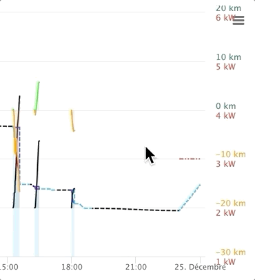
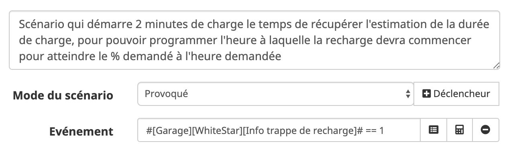

# Version 1.9.3 - 2020-01-08

### Améliorations
 * Le tracking calcule l'autonomie maximale de la batterie en fonction des données remontées par l'API. Cette valeur peut varier d'un jour à l'autre. Elle est affichée dans le tableau sur le selecteur des voitures

 * Possibilité d'exporter le graph du tracking sous forme d'image (png, jpeg, pdf, svg) ou en fichier (csv, xls):
    

 * Ajout des commandes suivantes qui peuvent être utilisées comme déclencheur de scénario:
   - `Info cable connecté` : valeur 1 quand le cable de recharge est engagé.
   - `Info ampérage de recharge` : valeur de l'ampérage en cours lors de la recharge.
   - `Info puissance de recharge` : valeur de la puissance en cours lors de la recharge.

Exemple:

 

 * Changement de l'icone "voiture" utilisée pour indiquer un trajet dans le tableau du tracking:

 

# Version 1.9.2 - 2019-12-02

### Correctifs

 * Correctif sur les Tesla virtuelles qui n'avaient pas de commandes ajoutées

# Version 1.9.1 - 2019-11-15

### Correctifs

 * Correctif sur le visuel du tracking affiché dans le widget
 * Correctif d'un bug qui pouvait empêcher le passage du tracking SOMMEIL NIGHT / SOMMEIL DAY

# Version 1.9.0 - 2019-11-07

### Highlights

 * Compatibilité Debian 10, et Freebox Delta
 * Meilleure prise en charge des periodes de veille du véhicule 

### Nouveautés

 * [**Range Tracking**] Refonte du mécanisme du tracking et son affichage. Après une durée d'attente au parking de 10 minutes, le tracking effectue un appel `data` toutes les 15 minutes, permettant ainsi à la voiture de se mettre en veille. Une fois en veille, le tracking surveille l'état de la voiture et se remet en mode NORMAL dès que celle-ci sort de sa veille. Les périodes de veille sont matérialisées par un trait pointillé noir sur le graph du suivi d'autonomie et le bouton du tracking se transforme en 'Lune qui ronfle". Un clic sur ce bouton permet de forcer manuellement le tracking en mode NORMAL. Lors des phases de veille le tracking ne fait que des appels "vehicle" pour surveiller le prochain réveil, ce qui garanti ZERO interaction avec la voiture. Le tracking est entièrement configurable via le panneau de configuration du plugin.
 
 * [**Range Tracking**] Ajout d'un mode `Live AUTO` qui permute automatiquement le graph entre la vue globale de la journée lors des phases de parking et la vue qui n'affiche que les 5 dernières minutes pendant la conduite

 * [**Range Tracking**] Ajout d'informations pertinentes sur le haut du graph. Le temps de conduite, la durée du parking ou le temps de recharge est indiqué, ainsi que le nombre de périodes de offline, le nombre de periodes de recharge.

### Améliorations

 * [**Widget**] Modification du visuel du bouton d'ouverture de la trappe de recharge.

### Correctifs

 * Sur Model X, l'affichage de la troisième rangée de sièges n'était pas visible. Problème corrigé.
 * La mise en marche du chauffage des sièges ne marchait pas depuis un scénario. Problème corrigé.
 * Non démarrage de la charge programmable suite à modification de l'API Tesla. Problème corrigé.
 * Suppression du message d'erreur `Highcharts error #15` qui pouvait conduire à un affichage du graph moins véolce. Problème corrigé.
 * Les erreurs `Incorrect integer value for 'isVisible'`, `class 'object' not found` et `Data too long for column 'name'` qui pouvaient apparaître sur Debian 10, sont maintenant corrigées.

Merci a tous les béta testeurs !

# Version 1.8.0 - 2019-09-24
### Nouveautés

 * [**Widget**] Ajout de commandes pour allumer et éteindre le volant et les sièges chauffants. Un panneau de contrôle animé permet de modifier l'état de chaque siège et du volant. Egalement pilotable depuis un scénario.
 * [**Widget**] Personnalisation des images de voiture. Quatre URLs permettent au plugin de télécharger quatre photos différentes (vue de profil, vue avant, vue arrière, vue intérieure).

### Améliorations

 * [**Configuration**] Ajout d'un bouton pour remettre les valeurs par défaut sur les principales variables de configuration du tracking.
 * [**Santé**] Vérifie si le VIN est présent dans la configuration dechaque voiture. Affiche une version "brouillée" du VIN (sans les six derniers chiffres).
 * Les images sont maintenant stockées en local pour répondre à une exigence Jeedom et faciliter/accélérer leur chargement.

### Correctifs

 * [**Santé**] Affichage du bon numéro de version dans le rapport de santé.
 * Suppression de l'affichage du message suivant : `Verification du démon:, {"type":"AJAX","code":42,"message":Unknown error"}`. Ce message sans gravité est remonté par Jeedom et est simplement ignoré.
 * L'ouverture et la fermeture du coffre fonctionnait mais ne rafraichissait pas l'état dans le plugin. Corrigé

### Compatibilité Debian

  * Jeedom n'est **pas compatible avec Debian 10**. Le plugin risque de rencontrer des difficultés s'il est installé sur une Debian 10. Se référer aux instructions d'installation de Jeedom : https://jeedom.github.io/documentation/installation/fr_FR/

Merci à `TheKiller83`, `Tonio16`, `Bob Jouy`... du forum [Automobile Propre](https://forums.automobile-propre.com/topic/piloter-sa-tesla-avec-jeedom-13412/) et `kenshirohokuto` du forum Jeedom pour vos retours et tests !

# Version 1.7.3 - 2019-09-09

### Nouveautés

 * [**Widget**] Ajout d'une commande pour ouvrir et fermer le port de recharge. Egalement pilotable depuis un scénario.

### Améliorations

 * Ajout du numéro de VIN sur la configuration du véhicule pour garantir une bonne synchronisation.

### Correctifs
  * Correctif sur l'apparence du bouton Sentinelle.

 
# Version 1.7.2 - 2019-08-27
### Correctifs

 * Mise à jour de l'un des appels vers l'API Tesla suite à la modification de l'un des endpoints (/data -> /vehicle_data). Certaines commandes pouvaient ne pas fonctionner. Corrigé.

# Version 1.7.1 - 2019-25-07

### Nouveautés

 * [**Widget**] Ajout d'un bouton pour activer/désactiver le mode Sentinelle.

### Améliorations

 * [**Range Tracking**] Les moments passés au parking avec le mode Sentinelle activés sont repérés par un trait pointillé rouge.
 * Le nom de la version est plus facile à lire dans le rapport de santé et dans le panneau de configuration: `vX.Y.Z` indique la version stable X.Y.Z et `vX.Y.Z-n-hash` indique la nième version bêta (et son hash git) après la version stable X.Y.Z. 

### Correctifs

 * [**Range Tracking**] Les trajets où la voiture devient hors ligne (tunnels, changement opérateur au passage d'une frontière,...) ne sont plus découpés. le pointillé passe en noir lorsque la voiture est vue hors ligne.

# Version 1.7.0 - 2019-06-16

### Nouveautés

 * Ajout du choix de la monnaie pour l'affichage (EUR, USD, CHF et GBP)
 * [**Range Tracking**] Ajout d'un mode sommeil qui va réduire la fréquence de mise à jour quand la voiture est arrêtée depuis 8 minutes. le jour la fréquence passe de 1 appel toutes les 5 secondes à 1 appel toutes les 60 secondes. La nuit (de 23h à 5h du matin) la fréquence passe à 1 appel toutes les 10 minutes. Les chiffres 8, 5, 60 et 10 ci-dessus sont modifiable dans le panneau de configuration.
  * [**Range Tracking**] Suite à l'ajout du mode sommeil, il est tout à fait possible de laisser Jeedom gérer le démon automatiquement.
  * [**Range Tracking**] Lorsque la voiture est détéctée hors-ligne, le graph de l'autonomie est affiché en pointillé noir.

### Améliorations

 * Amélioration des performance d'affichage sur les très gros fichiers de tracking.

Merci à `matts` du forum [Automobile Propre](https://forums.automobile-propre.com/topic/piloter-sa-tesla-avec-jeedom-13412/) pour ses retours et tests !

# Version 1.6.1 - 2019-05-15

### Nouveautés

 * [**Santé**] Ajout de tests de vérification pour s'assurer de la bonne santé du plugin (menu Analyse / Santé / plugin Tesla ).

### Améliorations

 * Lorsque la gestion automatique du démon du plugin est activé, le bouton de démarrage/arrêt du Suivi de l'Autonomie est désactivé.

### Correctifs

 * Vérification et réparation des autorisations des fichiers de Suivi d'Autonomie. 
 Un fichier qui n'a pas les bons droits (lecture/ecriture) peut conduire à un non affichage des graphes du *Suivi de l'Autonomie*.

Merci à `J0kers` du forum [Automobile Propre](https://forums.automobile-propre.com/topic/piloter-sa-tesla-avec-jeedom-13412/) pour ses retours et tests !

# Version 1.6.0 - 2019-05-07

### Nouveautés

 * [**Range Tracking**] Ajout du graph de la puissance de charge.
 * [**Range Tracking**] Possibilité de choisir les colonnes du tableau et de les trier.
 * [**Widget**] Ajout d'un bouton pour démarrer/arrêter le suivi de l'autonomie depuis le widget (desktop et mobile)

### Améliorations

 * Amélioration de la gestion du process qui pilote le suivi de l'autonomie.
 * Prêt pour Jeedom V4 !

### Correctifs

 * Correctif mineurs

### Instructions de mise à jour

 * Suite au passage du cron en 'daemon', il est conseillé de ne pas activer la *Gestion automatique* du démon dans la configuration du plugin. 
 En effet, lorsque la gestion automatique est activé, Jeedom va s'assurer que le daemon est actif en toute occasion et ira le relancer s'il a été arrêter.
 Pour le cas du *Suivi d'Autonomie*, on preferera l'arrêter et le démarrer soit même.

# Version 1.5.2 - 2019-04-08

### Améliorations

 * [**Range Tracking**] Déplacement des fichiers de tracking dans le répertoire du plugin - migration transparente au moment de l'update du plugin.
 * [**Command**] Meilleure gestion du calcul de l'heure de début de recharge.
 * Prise en charge de l'heure UTC (donc fuseaux horaires et passages heure été/hiver).
 * Plusieurs tentatives quand le serveur Tesla ne répond pas (Erreur 500) avant d'afficher un log d'erreur.
 * Remise à plat de l'écriture des traces INFO et DEBUG dans le log `tesla`.
 * [**Command**] Ajout de `Info niveau de batterie` qui indique le pourcentage de la batterie.

### Correctifs

 * Pas d'accès aux équipements s'ils sont désactivés ou quand le plugin est lui même désactivé.
 * [**Widget**] Affichage correct des jantes 20" et du pack Performance le cas échéant sur la Model3
 * [**Widget**] Prise en compte des couleurs de carrosserie de la Model 3.
 * [**Widget**] Sur certains navigateurs web, le curseur de la limite de charge pouvait s'afficher en blanc. Corrigé.
 
### Problème connu

 * [**Scenario**] La nuit, une trace peut indiquer que la charge est impossible a démarrer, mais elle pourra être démarrer en asynchrone par le serveur. Il est recommandé d'ajouter dans le scénario une commande de réveil de la voiture.

# Version 1.5.1 - 2019-03-20

### Améliorations

 * [**Suivi de l'Autonomie**] Amélioration des performances lors de l'affichage du graph.
 * [**Command**] "Info Recharge" retourne 'Driving' quand la voiture se déplace.

### Correctifs

  * [**Widget**] Correctif au niveau de l'unité d'énergie (kW -> kWh).
  * [**Suivi de l'Autonomie**] Le premier trajet de la journée pouvait être vu en état "Parking". Corrigé

# Version 1.5.0 - 2019-03-14

### Nouveautés

* [**Suivi de l'Autonomie**] Il est maintenant possible de choisir entre l'affichage des kilomètres gagnés ou perdus et l'énergie consommée. Des informations sur la capacité de la batterie sont à renseigner au niveau de la configuration du véhicule.

### Améliorations

 * [**Suivi de l'Autonomie**] Live activé par défaut sur les 5 dernières minutes quand la voiture est en marche.
 * [**Suivi de l'Autonomie**] Checkbox "Live" supprimée. Un choix "LIVE OFF" est intégré dans le sélecteur de la "largeur" du live
 * [**Suivi de l'Autonomie**] Mise à jour des min/max des courbes selon les données affichées pour un meilleur rendu visuel.
 * [**Suivi de l'Autonomie**] Dans la version Mobile, sur un écran large, les courbes sont plus épaisses pour un meilleur rendu sur l'écran de la Tesla par exemple.
 * [**Widget**] Fenêtre modale de confirmation sur les boutons d'ouverture de portes et coffres.
 * Ajout d'une Model Y rouge dans les Tesla virtuelles.
 
### Correctifs

 * [**Suivi de l'Autonomie**] Quand le chauffage est allumé, seule la ligne change de couleur. Même couleur du fond de courbe si chauffage est on ou off
 * [**Widget**] Sur une Model 3, l'image affiche maintenant la couleur et les jantes qui correspondent au véhicule. Egalement, la gestion du toit ouvrant est supprimés sur la Model 3.

### Astuce

* [**Suivi de l'Autonomie**] Pour accéder directement à la vue `Tesla` depuis la version Mobile sans jongler avec les menus, il est possible de définir `Tesla` comme vue "Mobile" par défaut dans la configuration du profil (Menu `User` -> `Profil Admin` -> Onglet `Interface`)

### Problème connu

* [**Suivi de l'Autonomie**] Sur les journées où il y a eu beaucoup d'aquisition lors de long parcours, l'affichage peut être long, voire ne pas être possible.

Un grand merci à `Bob Jouy` (https://twitter.com/bobjouy) pour ses retours et suggestions d'améliorations !

# Version 1.4.2 - 2019-02-14

### Améliorations

* [**Suivi de l'Autonomie**] Une nouvelle commande 'Contrôler le suivi de l'autonomie' permet de démarrer/arrêter le suivi de l'autonomie depuis un scénario.
* [**Widget**] Affiche un texte indiquant l'installation d'une mise à jour logicielle et le temps restant, le cas échéant.

### Correctifs

* Correctif sur le texte d'info de dernière mise à jour qui pouvait afficher successivement plusieurs valeurs différentes.

# Version 1.4.1 - 2019-02-08

### Améliorations

* [**Scenario**] La commande 'Contrôle de la recharge' admet un nouvel argument 'Estimer' qui va: démarrer une charge, attendre 2 minutes, calculer l'heure de départ et arréter la charge. Note: le scénario de départ de charge est simplifié.

# Version 1.4.0 - 2019-02-04

### Nouveautés

* [**Scenario**] Ajout de la commande qui va retourner l'heure de départ de la charge, pour qu'elle soit chargée à x% à une heure donnée. Utilisable dans un scénario Jeedom (cf documentation).

# Version 1.3.1 - 2019-01-30

### Améliorations

* [**Suivi de l'Autonomie**] En mode live la courbe d'autonomie devient violette quand le chauffage est activée.
* [**Suivi de l'Autonomie**] Il est possible maintenant d'afficher un graph d'exemple sur une voiture virtuelle.
* Augmentation du panel mobile (x2) quand la taille de l'écran le permet.

### Correctifs

* Correctifs pour une meilleure stabilité et maintenabilité.

# Version 1.3.0 - 2019-01-23

### Nouveautés

* Ajout d'un panneau de '**Suivi de l'Autonomie**' qui permet de visualiser sur un graphique, l'évolution de l'autonomie en fonction de l'état de la voiture : **conduite**, **recharge** et **parking**.

### Problème connu

* Le panneau de 'Suivi de l'Autonomie' n'est pas encore traduit en anglais.

# Version 1.2.2 - 2019-01-07

### Améliorations

* Ajout d'une indication de la dernière date de mise à jour ("A l'instant", "Mise à jour il y a 2 mintues", ...).

### Correctifs

* Suppression du message "Erreur d'accès au Seveur Tesla", lors du réveil de la voiture.

# Version 1.2.1 - 2018-12-22
### Correctifs
* Le plugin est maintenant compatible avec PHP 5.6.

# Version 1.2.0 - 2018-12-19

### Nouveautés

* Ajout du widget Mobile.
* Ajout d'une commande Info qui remonte la température intérieure (utile pour un scénario de mise en route de la clim par exemple).
* Ajout d'une commande de réveil de la voiture qui effectue 3 tentatives de réveil espacées de 5 secondes (3 et 5 sont configurables au niveau du plugin).
* Lors de la mise à jour du plugin, celui-ci synchronisera vos véhicules configurés.

### Améliorations

* Les principales commandes d'actions peuvent être utilisées dans des scénarios.
* Plus de traduction en anglais.

### Correctifs

* Correction sur le bouton d'ouverture du toit ouvrant.

### Problème connu

* La fonction de reveil marche mieux lorsque le mode **Connexion permanente** est activé dans la voiture.

Un grand merci à `Kim` pour ses retours et suggestions d'améliorations !

# Version 1.1.0 - 2018-12-10

### Nouveautés

* Contrôle des températures de climatisation pour le conducteur et le passager.
* Contrôle des ouvrants (coffre avant, coffre arrière, toît ouvrant).
* Contrôle de la limite de recharge via dashboard et scenario.
* Affichage des températures en `°C` ou `°F` selon configuration du véhicule.
* Affichage des distances en `km` ou `miles` selon configuration du véhicule.

### Améliorations

* Ajout d'effets sur les boutons cliquables pour les rendre plus visibles.
* Optimisation et nettoyage du code (utilisation d'une feuille de style unique partagée entre les différents templates, ...)

### Problème connu

* [Temp settings] A cause d'une limitation sur l'API Tesla, il n'est pas possible de passer de `SYNC` à `Not SYNC`. En conséquence, il n'est possible de configurer la température du passager que si dans la voiture les températures ne sont pas synchronisées (`Not SYNC`)).

# Version 1.0.0 - 2018-11-29

### Nouveautés

* Ceci est la première version **stable** publiée sur le Jeedom market !
* Les prochaines versions ajouteront de nouvelles fonctionalités (contrôle des temperatures, Contrôle de la limite de charge ...) !

Un grand merci à l'équipe Jeedom  `Loic` and `Alexandre`, et aux béta-testeurs `carfnann` et `philippe` pour leurs tests et commentaires !

# Version 0.3.0 - 2018-11-23

### Correctifs

* Rafraichissement du bouton de recharge après avoir cliqué dessus.
* Affichage du pourcentage de la batterie dans le graph.
* Ajout d'un bouton pour supprimer les Tesla virtuelles.
* Ajout de Model 3 et Roadster dans la liste des Tesla virtuelles.
* Amélioration de la phase d'authentification (jeton d'accès et login).

# Version 0.2.0 - 2018-11-18

### Nouveautés

* Mise à jour de la documentation
* Ajout de l'anglais comme langue disponible

# Version 0.1.0 - 2018-11-10

**Ceci est la première version **béta** publiée sur le market de Jeedom**

* Contrôle et affichage de la recharge
* Contrôle et affichage de la climatisation
* Contrôle et affichage du vérouillage
