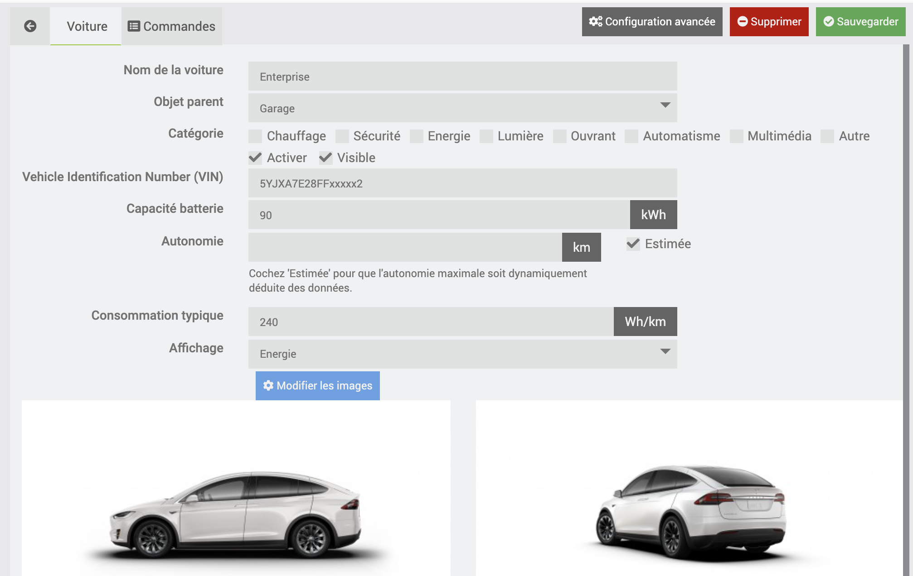
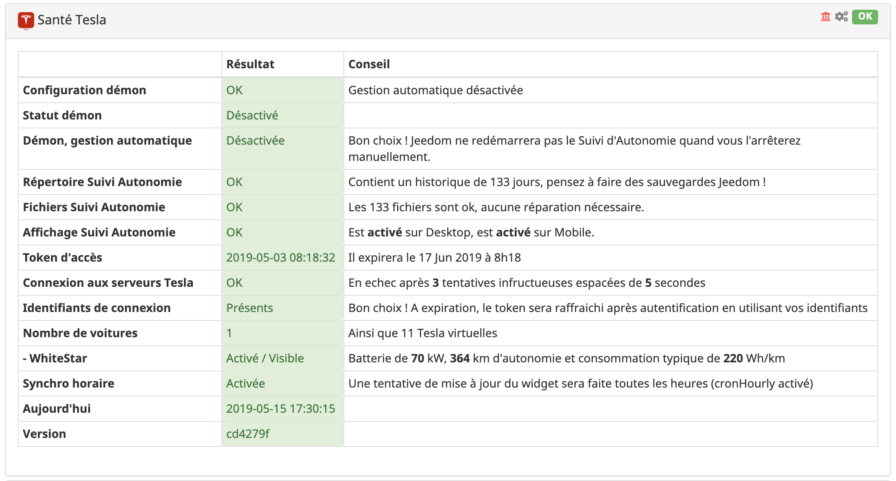
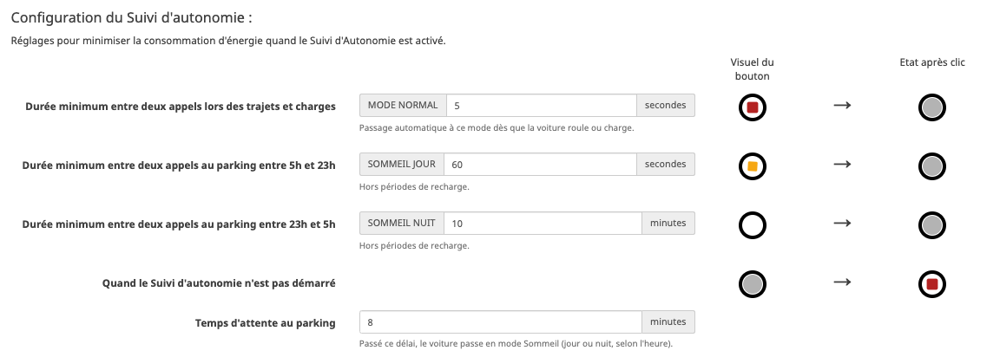

Introduction
===
Bienvenue sur la page de documentation du plugin Tesla de Jeedom ! 

Avec ce plugin l'utilisateur peut accéder à sa voiture Tesla et intéragir avec les données remontées par l'API proposée par Tesla.

Les informations proposées par Tesla peuvent être utilisées dans votre domotique et des actions peuvent être executées dans vos scénarios Jeedom, pour par exemple démarrer une recharge à une heure précise selon l'endroit, fermer les fenêtres s'il pleut, allumer la climatisation le matin s'il fait froid, ajuster l'ampérage de recharge selon la capacité de production de vos panneaux photovoltaïques, .... 

Ce plugin propose également un panneau pour suivre sur un graphique l'évolution de l'autonomie et de l'énergie au cours d'une journée, au gré des kilomètres parcourus:

Sur ce même panneau, vous trouverez un tableau récapitulatif des étapes de la journées (conduite, charge, parking). Il détaille les durées, consommation, vitesse, ... de chaque étape, les colonnes sont modifiables et peuvent être triées.

Une carte permet aussi de retracer l'ensemble des trajets d'une journée, de définir des favoris, de suivre à la trace votre voiture depuis l'écran de votre Tesla ! 

 

Et parce que ce plugin est une composante de votre système de domotique, votre Tesla rejoint tous les équipements de votre maison. Ce qui vous permettra de les combiner entre eux pour des affichages ou des actions coordonnées. 

Retrouvez la liste des nouveautés sur le [Change log](http://tesla.jeedom.free.fr/changelog).

Connexion au compte Tesla
=======================

La configuration est très simple, après téléchargement du plugin, il
vous suffit de l’activer et de renseigner le jeton d'accès necessaire pour accéder à votre compte Tesla.

Pour permettre au plugin d'intéragir avec votre Tesla, un **jeton d'authentification** doit être renseigné. Ce jeton est obtenu en utilisant une application dédiée. Comme par exemple :    
 * [Auth app for Tesla](https://apps.apple.com/us/app/auth-app-for-tesla/id1552058613) 
  * [Tesla Tokens](https://play.google.com/store/apps/details?id=net.leveugle.teslatokens)

Ces applications utilisent la page d'authentification du site officiel Tesla et vous donnent après connexion deux jetons:
 * le **jeton d'accès** : il est utilisé par le plugin dans ses échanges avec les serveurs Tesla. Ce jeton est valide environ 45 jours.
  * le **jeton de rafraichissement** : s'il est indiqué, il permettra au plugin de remplacer automatiquement le **jeton d'accès** quand il expire.

> **Note**
>
>  - Ce plugin nécessite que votre Tesla soit accessible sur le réseau pour que la configuration se passe correctement. 
>  - Si l'application Tesla sur votre smartphone arrive à se connecter à votre Tesla, le plugin sera à même de configurer correctement votre Tesla dans Jeedom.
> -  Le plugin Tesla de Jeedom ne necessite pas les identifiants de votre compte Tesla. 

Tesla virtuelle
--

Pour tester le plugin sans connexion à votre compte Tesla, ou si vous n'avez pas (encore) de Tesla, le plugin offre la possibilité de créer des équipements virtuels correspondants à des Tesla __Model 3__,  __Model Y__, __Model S__ et/ou __Model X__.

Il suffira de cliquer sur le bouton __"Ajouter des Tesla virtuelles"__. Des jeux de données correspondants à des véhicules réels seront utilisés pour créer des équipements virtuels. Bien entendu toute action (chauffage/charge/dévérouillage) sur ces équipements sera sans effet, mais du plus bel effet dans votre interface Jeedom.

Deconnexion
--

Une fois connecté, le plugin affiche un bouton de deconnexion qui revoquera le token d'authentification auprès des serveurs Tesla. Après révocation, il ne pourra plus être utilisé. Il faudra en générer un autre. 

Configuration du plugin
=======================

Après connexion, le plugin pourra se connecter aux serveurs Tesla et récupèrera la ou les Tesla associées à votre compte pour créer les "équipements" Jeedom automatiquement.

Le bouton __"Synchroniser mes voitures"__ permet d'effectuer une recherche manuelle et ajoutera un équipement Jeedom pour chaque véhicule Tesla non encore créé. Cela permet également de mettre à jour les équipements associés à vos Tesla après une mise à jour du plugin. 

Démon
--
Le suivi de l'autonomie repose sur des jeux de données acquises via l'API des serveurs Tesla. L'acquisition de ces données est effectuée par un script qui doit tourner en arrière plan. Son démarrage se pilote depuis le panneau de contrôle du plugin. Il est recommandé d'activer la **Gestion Automatique** pour que Jeedom le redémmarre s'il s'arrête. 

Tracking
--

Pour accéder aux panneaux de suivi de l'autonomie (également appelé "tracking"), il suffit de cocher `Afficher le panneau desktop` et `Afficher le panneau mobile`:  

Une fois cochées et après rechargement de la page, un sous menu "Tesla" apparait dans le menu "Accueil". Il conduit alors au tracking :

Autres paramètres de configuration
--

- **Coût du kWh** (en euro) : Nécessaire pour calculer approximativement le cout d'une charge, le prix pour parcourir 100km et le nombre de km que l'on peut faire avec 1 euro. La valeur par défaut est `0.14`.
- **Tesla Client ID** et **Tesla Client Secret** : deux clefs publiques qui sont nécessaires pour accéder à l'API du serveur des Tesla. Déjà renseignées, ces clefs peuvent être modifiées au cas où l'API requiert de nouvelles valeurs.
- **cronHourly** : S'il est activé, une fois par heure, le plugin fait une mise à jour des données du widget. Quand le tracking est actif, les données du widget sont mises à jour au fil de l'eau.  

Configuration du véhicule
=======================

Une fois le plugin configuré, le ou les véhicules de votre compte tesla sont ajoutés. 

 

 Un lien **Documentation** permet d'afficher cette documentation, et un lien **Aide** apporte un premier niveau d'aide en cas de besoin.

Pour configurer le véhicule, il suffit de cliquer sur son image. Il sera alors possible de l'activer, le rendre visible et l'attacher à un objet parent (ici le Garage) :

 

 * __Vehicle Identification Number (VIN)__ : Champ obligatoire qui permet d'identifier de manière unique votre véhicule pour intéragir avec les serveurs Tesla.
 * __Capacité batterie__ : La capacité "commerciale" de la batterie en kWh
 * __Autonomie__ : le nombre de kilomètres qu'il est possible de parcourir avec 100% d'autonomie. Vous pouvez choisir de laisser le plugin estimer le nombre de kilomètre qu'il est possible de faire avec un 'plein' (cocher alors "estimer").
 * __Consommation typique__ : En théorie, c'est le rapport entre `Capacité batterie x 1000 / Autonomie`. Ajustable selon ses propres constatations.
 * __Affichage__ : L'affichage par défaut du Suivi de l'Autonomie. Choix : `Energie` ou `Distance`. 

Et vous pourrez également choisir une image pour votre voiture.

Liste des commandes et des actions du véhicule
=======================
Les commandes d'info et d'action associées à chaque Tesla sont les suivantes

 

Commandes de type **info**
--

| Commande   |   Description |
| --- | --- |
| **Photo** | Affiche une photo de la Tesla, ainsi que le badge (70D, P85D, ...).
| **Info réveillée** | Indique si le véhicule est en mode veille (0) ou en ligne (1).
| **Info autonomie** | Indique l'autonomie typique (en km ou miles) de la voiture.
| **Info autonomie nominale** | Indique l'autonomie nominale (en km ou miles) de la voiture.
| **Info climatisation** | Indique si la climatisation est allumée ou éteinte.
| **Info température habitacle** | Indique la température à l'intérieur du véhicule.
| **Info recharge** | Indique si la voiture est en train de charger ou non. Les valeurs possibles sont  { `Charging`, `Stopped`, `Disconnected`, `Complete`, `Scheduled`, `Driving` }.
| **Info cablle connecté** | Indique si le cable de recharge est connecté.
| **Info niveau de batterie** | Indique le pourcentage de la batterie.
| **Info limite de recharge** | Indique le pourcentage à atteindre à la fin d'un recharge.
| **Info verouillage** | Indique si la voiture est fermée ou ouverte.
| **Info frunk** | Indique si le coffre avant (frunk) est fermé ou ouvert.
| **Info trunk** | Indique si le coffre arrière est fermé ou ouvert.
| **Info toît ouvrant** | Indique si le toit panoramique est ouvert ou fermé.
| **Info heure de départ de recharge** | Indique l'heure (format Hmm) à laquelle la charge est censée débuter.
| **Info heure de fin de recharge** | Indique l'heure (format Hmm) à laquelle la charge est censée se terminer.
| **Odomètre** | Indique la valeur du compteur kilométrique (miles ou km).
| **Info véhicule** | Affiche un titre et un sous titre correspondant à l'état actuel de la voiture. Par exemple _Conduite 67km_, _Recharge planifiée à 22h50_, _Stationnée_, _Supercharge_, ...
| **Détail autonomie** | Affiche un graphe de la batterie
| **Détail de la recharge** | Affiche les données issues de la recharge.
| **Détail de la climatisation** | Affiche les paramètres de climatisation (conducteur, passager, intérieur et extérieur). 
| **Détail data** | Pour debug - affiche un buffer encode en 64bits débarassé de toute info personnelle (VIN/id/GPS/...).
| **Info sapproche de** | Nom du favori duquel se rapproche la voiture.
| **Info séloigne de** | Nom du favori duquel s'éloigne la voiture.
| **Info date dernier franchissement** | Timestamp qui indique l'heure à laquelle la frontière du dernier favori a été franchie.

Commandes de type **action**
--

| Commande   |   Description |
| --- | --- |
| **Contrôler la recharge** | Va permettre de démarrer, interrompre, ou estimer la charge si le cable de recharge est engagé.
| **Contrôler la limite de charge** | Va permettre de définir un pourcentage de charge a atteindre.
| **Contrôler la climatisation** | Va permettre d'allumer ou d'arreter la climatisation.
| **Contrôler la température** | Va permettre de définir une température dans l'habitacle (conducteur/passager).
| **Contrôler le vérouillage** | Va permettre de vérouiller ou déverouiller la voiture.
| **Contrôler le coffre avant** | Va permettre de vérouiller ou déverouiller le coffre avant (frunk).
| **Contrôler le coffre arrière** | Va permettre de vérouiller ou déverouiller le coffre arrière (trunk).
| **Contrôler la trappe de charge** | Va permettre d'ouvrir/fermer la trappe de recharge.
| **Contrôler le toit ouvrant** | Va permettre d'entrouvrir ou de fermer le toît panoramique.
| **Contrôler l'heure de fin de recharge** | Va permettre de définir l'heure (format Hmm) à laquelle la charge devra se finir.
| **Contrôler le suivi de l'autonomie** | Va permettre de démarrer ou arrêter le suivi de l'autonomie.

| **Rafraichir** | Mise à jour de la tuile sur clic de l'icone.
| **Réveiller** | Force le reveil de la voiture (3 tentatives espacées de 5s). Peut-être utile dans un scénario. Met à jour la valeur de **Info reveillée**.

> **Tip**
>
> Chacune de ces actions peut être intégrée dans un scénario Jeedom.
>
> Le format **Hmm**, est utilisé dans les blocs d'action des scénarios qui permettent de programmer une heure de début d'action. Exemples: 
>  - `2305` indique 23h05, 
>  - `18` indique 00h18,
>  - `1200` indique 12h00,
>  - `1210`indique 12h10,
>  - `121` indique 1h21
> 

Affichage du véhicule
=======================

La plupart des commandes listées ci-dessus a un template spécifique qui lui est attribué, et qui permet d'obtenir par défaut l'affichage d'un véhicule tel qu'illustré sur l'image:

### Version Desktop:

### Version Mobile:

Par exemple pour ne pas afficher la photo et les détails de climatisation, il suffit pour un véhicule donné de décocher `"Affichage"` dans la ligne correspondante de la configuration de ces commandes.

L'odomètre est historisé, ce qui permet d'obtenir le graphique des km parcourus.

Par défaut, le widget est mis à jour toutes les heures entre 5h du matin et 23h. Il est possible de désactiver cette mise à jour en décochant "Activer" en face de "cronHourly"

Contrôler la climatisation, les sièges et le volant chauffants
--

| Bouton | Description | Un clic sur ce bouton va ... | 
| --- | --- | --: |
|  | La climatisation est éteinte | _... allumer la climatisation_ | 
|  | La climatisation est allumée | _... éteindre la climatisation_ |
|  | Le volant ou un des sièges chauffants est allumé | _... ouvrir le panneau de contrôle des sièges chauffants_ |
|  | Aucun des sièges chauffants ni le volant n'est allumé | _... ouvrir le panneau de contrôle des sièges chauffants_ |

Il est possible de modifier la température cible de la climatisation en utilisant un widget secifique, comme décrit dans l'animation ci-dessous:

Après avoir cliqué sur l'icone de siège, il est possible de contrôler le niveau de chauffage des sièges et du volant. Le nombre de rangées affiché dépend de la configuration du véhicule. Egalement, si le volant est chauffant, il est activable via ce panneau de contrôle.

Le bouton OFF permet de tout éteindre. Le bouton OK permet de valider les choix faits pour chacun des sièges et du volant: 

 

> **Notes**
>
> A cause d'une limitation dans l'API Tesla, il n'est possible de configurer des températures différentes pour le conducteur et le passager que lorsque les températures sont déjà non synchronisées dans le véhicule (SYNC désactivé).
>
> L'accès au sièges chauffants n'est possible que si la climatisation est allumée.

Contrôler le vérouillage (portes, coffres, toît ouvrant et sentinelle)
--

| Bouton | Description |  Un clic sur ce bouton va ... |
| --- | --- | --: |
|  | La voiture est fermée | _... dévérouiller les portes_ |
|  | La voiture est ouverte | _... vérouiller les portes_ |
|  | Le coffre avant est fermé | _... dévérouiller le frunk_ |
|  | Le coffre avant est ouvert | _... être sans effet_ |
|  | Le coffre arrière est fermé | _... ouvrir le coffre_ |
|  | Le coffre arrière est ouvert | _... fermer le coffre_ |
|  | Le toît panoramique est fermé | _... ouvrir le toît panoramique_ |
|  | Le toît panoramique est ouvert | _... fermer le toît panoramique_ |
|  | Le mode sentinelle est désactivé | _... active le mode sentinelle_ |
|  | Le mode sentinelle est activé | _... désactive le mode sentinelle_ |

Contrôler la charge
--

| Bouton | Description |  Un clic sur ce bouton va ... |
| --- | --- | ---: |
|  | Le cable de charge n'est pas engagé | _... être sans effet_
|  | La recharge est programéee | _... démarrer la recharge_
|  | La recharge est en cours | _... stopper la recharge_
|  | La recharge a été manuellement arrétée | _... reprendre la recharge_
|  | La recharge est terminée | ... _être sans effet_
|  | Etat de recharge indéterminée | ... _être sans effet_
|  | Ouverture de la trappe de recharge | _... ferme/ouvre la trappe de recharge_ |

Contrôler le suivi de l'autonomie
--

| Bouton | Description |  Un clic sur ce bouton va ... |
| --- | --- | ---: |
|  | Le suivi de l'autonomie est arrêté | _... démarre le suivi de l'autonomie_
|  | Le suivi de l'autonomie est démarré | _... arrête le suivi de l'autonomie_
|  | Le suivi de l'autonomie est démarré en mode SOMMEIL jour| _... arrête le suivi de l'autonomie_
|  | Le suivi de l'autonomie est démarré en mode SOMMEIL nuit| _... arrête le suivi de l'autonomie_
|

> **Note**
>
> - Si dans la configuration du plugin la **Gestion Automatique** du démon est activé, Jeedom cherchera à redémarrer le démon s'il est arrêté. Vous pouvez donc laisser Jeedom garantir que le `tracking` est actif en permanance (**Gestion Automatique**) ou le démarrer et l'arrêter manuellement.
> - Si la **Gestion Automatique** du démon est désactivé il suffit de tenir appuyé sur le bouton du tracking au moins 5 secondes pour voir apparaître le bouton __STOP__.

Pour modifier depuis le dashboard la limite de charge, il suffit de délacer le curseur sur le graphe de la batterie. Le pourcentage ainsi que le nombre approximatif de kilomètres seront affichés:

Santé
==

Pour s'assurer que le plugin Tesla est bien configuré, un ensemble de vérifications est joué lorsque on ouvre l'écran **Santé** (menu Analyse / Santé).

> ** Note**
>
>Si un problème de permission est détecté, il sera corrigé.

Scenario
==

Exemples de scénarios: 

* Modifier le seuil de recharge à son maximum :
  

* Reveiller la voiture et mettre le seuil de charge à 90% et activer la climatisation si la température de l'habitacle est inférieur à 14°C :

  

* Programmer le départ de la charge pour que la voiture ait 90% de batterie à 7h00 !
  

> **Note** 
>
> Pour connaître l'heure de début de la recharge, il faut démarrer la charge avec l'action 'estimer' qui va démarrer une courte charge pour estimer le temps nécessaire pour la recharge. 
>
> Si la voiture n'est pas prète pour la charge, la commande **Info heure de départ de recharge** retourne `N/A`. 
>
> Si le temps estimé est inférieur au temps qui sépare le moment où la commande est lancée et l'heure de fin de recharge, la commande **Info heure de départ de recharge** retourne l'heure au format `Hmm` à laquelle la charge pourra être lancée.
>
> S'il n'y a pas assez de temps pour atteindre le pourcentage voulu à l'heure programmée, la commande **Info heure de départ de recharge** indique l'heure de départ précédé du signe `-`.
>
> Exemples si l'on souhaite avoir la voiture chargée à **90%**  pour **7h du matin** :
> - il est 22h30, le scénario est lancé, la recharge demande **5 heures et 30 minutes** : la commande **Info heure de départ de recharge** retourne `130`  (soit démarrage de la charge conseillé à 1h30).
> - il est 22h30, le scénario est lancé, la recharge demande **12 heures** : la commande **Info heure de départ de recharge** retourne `-1900`  (soit démarrage de la charge conseillé à 19h, mais il est trop tard !)

Suivi de l'autonomie
==

Note: Le *Suivi de l'autonomie* est aussi appelé *Range Tracking* ou simplement *tracking*. 

Principe
--

Le panneau **suivi de l'autonomie** permet au conducteur de comprendre l'influence de sa conduite et de l'environement sur l'autonomie du véhicule, pour chacune des Tesla activées dans votre Jeedom.

Cela permet de comprendre comment évolue l'autonomie restante au fil des trajets, des charges et temps de repos, ou de voir l'énergie consommée lors des trajets, et l'énergie emmagasinée lors de recharges.

Ce 'tracking' s'appuie sur des données acquises depuis les Servers Tesla via un démon qui est démarré et arrêté depuis le panneau. Les données sont stockées en **local** sur votre serveur Jeedom.

Un graphique retrace l'évolution de l'autonomie ou de l'énergie au cours d'une journée et un calendrier permet de consulter l'historique des graphiques.

> **Notes**
>
> * Pratique, la version mobile permet de suivre l'évolution de l'autonomie ou de l'énergie tout en conduisant !
> 
> * Pour accéder directement à la vue `Tesla` depuis la version Mobile sans jongler avec les menus, il est possible de définir `Tesla` comme vue "Mobile" par défaut dans la configuration du profil (Menu `User` -> `Profil Admin` -> Onglet `Interface`)
>
> * Le suivi de l'autonomie peut être programmé via un scénario.

Configuration et impact du tracking
-- 

Lorsque le véhicule roule ou est en charge, les graphs permettent de donner une idée très précise de l'évolution de l'autonomie. En revanche, à l'arrêt au parking, il n'est pas nécessaire de monitorer aussi finement l'état de la voiture.

Passé un certain laps de temps (`temps d'attente au parking`) le tracking ralentit son rythme et espace les différents appels, passant par défaut d'un appel toutes les 5 secondes lors du roulage et des recharges à un appel toutes les 15 minutes minutes (`SOMMEIL JOUR`) laissant la possibilité à la voiture d'entrer en veillle. La nuit, ce rythme décroit encore plus puisqu'il passe à un appel toutes les trente minutes (`SOMMEIL NUIT`).
Ces intervalles de temps sont configurables, ainsi que les heures de début et de fin de la periode de `SOMMEIL NUIT`

Quand la voiture se remet à rouler/charger, le prochain appel va detecter ce changement d'état et fera passer le tracking en mode `NORMAL`, pour garantir un suivi régulier du tracking.

#### Considérations techniques:
Tesla propose sur son API deux appels d'interrogation du véhicule:
 - un appel nommé `data` qui indique simplement l'état de la voiture : `online`, `offline`, `asleep`, `waking` et `unknown`. Cet appel n'est pas intrusif, il ne rentre pas en contact avec la voiture. `online` indique que la voiture roule, charge, télécharge une mise à jour, effectue une opération interne de service.... Mais elle peut tout à fait être `online` au parking. Et, sans être sollicité pendant un certain temps au parking, elle pourra automatiquement rentrer dans une phase de sommeil (`offline`/`asleep`). Hélas, sur cet appel, il n'y a pas de distinguo entre un `online "actif"` (roulage, charge, ...), et un `online "inactif"` (au parking en attente d'un prochain sommeil), ce qui permettrait de detecter la phase de pré-sommeil.
- un appel nommé `vehicle` qui remonte toutes les données pertinentes et à jour sur le véhicule. Cet appel `vehicle` n'est possible que lorsque la voiture est `online`. Solliciter trop fréquement  cet appel `vehicle` empèche la voiture de passer `offline`. 

Avant chaque appel `vehicle` le tracking effectue un appel `data`. Si ce dernier remonte un état `offline` ou `asleep`, le tracking laisse la voiture dans son sommeil et ne vas pas effectuer d'appel `vehicle`. Dans le cas contraire (`online`) le tracking effectue l'appel `vehicle` et stocke un nouveau jeu de données qui sera utilisé pour les graphs et les statistiques.

Mise en place
--
Par défaut, l'acquision n'est pas démarrée.

Un clic sur `Start Recording` va démarrer le démon qui va récupérer à intervalles réguliers les données qui serviront à afficher des graphiques de suivi, identifier les différentes étapes de la journée et proposer des statistiques.

Un clic sur `Stop Recording` va stopper l'acquisition des données (arrêt du démon).

Lorsque le démon est en mode **Gestion Automatique**, il n'est pas possible d'interagir manuellement pour arrêter/démarrer le démon. 

> **Notes**
>
> Lors de l'acquisition et si le graphe affiché est le graphe du jour, l'affichage bascule automatiquement en en mode `live`, et affiche en temps réel les dernières données acquises.
>
> Au premier lancement, il peut se passer plusieurs minutes avant que des données soient
effectivement disponibles pour l'affichage.

Exemple affichage __distance__
--
L'exemple ci-dessous retrace un trajet réél effectué le 5 janvier 2019, qui se découpe principalement en 4 segments : 
- <code>km  0</code> à <code>km 15</code>: route départementale sur du plat - _altitude 'en haut': 1100m._
- <code>km 15</code> à <code>km 30</code>: route départementale en descente -  _altitude 'en bas': 250m._
- <code>km 30</code> à <code>km 50</code>: autoroute.
- <code>km 50</code> à <code>km 65</code>: route départementale - _altitude à l'arrivée: 500m._

 

- En abscisse on trouve le temps
- En ordonnée à gauche en <b>noir</b>, le kilométrage parcouru. <u>Note:</u> l'angle de la courbe est proportionel à la vitesse.
- En ordonnée à gauche en <b style='color:#22C4FF'>bleu</b>, l'autonomie de départ en <b style="color:#3355FF">pointillé</b>, et l'évolution de l'autonomie en <b style='color:#22C4FF'>bleu</b>. Quand la climatisation est allumée, le trait est en <b style='color:blueviolet'>violet</b>.
 - En ordonnée à droite, la différence constatée entre l'<b style="color:#3355FF">autonomie initiale</b> et l'<b style='color:#22C4FF'>autonomie réelle</b> compte tenu des <b>kilomètres parcourus</b>. La courbe est <b style="color:#00FF00">verte</b> quand il y a un gain, <b style="color:#FFA500">orange</b> en cas de perte. Et la <b style="color:#E74C3C">puissance de charge</b> quand la voiture est en cours de recharge. 

Un tableau récapitulatif par journée est affiché et permet sur selection d'une ligne de zoomer sur le graphe correspondant. Un clic sur la ligne "Total" va afficher la journée complète.

 

- L'`efficience` correspond au pourcentage de km gagnés/perdus par rapport à la longueur du trajet, ce qui permet de pondérer les résultats. Les petits trajets sont 'énergivores'.
 - Les trois boutons en haut à droite du tableau permettent de filtrer par type d'étape et de pouvoir par exemple calculer les pertes liées aux seules étapes de type `parking`.
 

Exemple affichage __énergie__
--
Depuis la version `1.5.0` du plugin, il est possible de permutter entre mode `distance` et `énergie` en cliquant sur le selecteur.
Dans ce mode, la courbe <b style="color:#00FF00">verte</b>/<b style="color:#FFA500">orange</b> laisse place à une courbe qui décrit le cumul de l'énergie consommée/produite avec trois zones pour identifier :
 * la <b style="color:#FF0000">sur-consommation</b> lorsque l'on dépasse l'autonomie typique (ici `220Wh/km`) ,
* la <b style="color:#FFA500">sous consommation</b>
*  et la <b style="color:#00FF00">production</b> lorsque le cumul de l'energie est négatif.

Le Tableau retranscrit les informations d'énergie. Les données sont affichées en <b style="color:darkgreen">vert</b> lorsque le voyage a consommé en moyenne moins que le typique et en <b style="color:#FF0000">rouge</b> sinon.

> **Notes**
>
> - En dehors des plages de conduite, le graphique affiche l'évolution de l'autonomie à l'arrêt, et permet par exemple de tracer les pertes de type <i>"vampire drain"</i> et de voir les courbes lors des recharges.
> - Activer en continu le recording peut conduire à une consommation d'énergie non souhaitée.

Cartographie
==

La version 2.0.0 du plugin introduit la cartographie qui permet :
 - de traduire les lieux de parking en adresses physiques,
 - d'afficher sur le tableau du tracking les lieux de départ et d'arrivée,
 - de définir un lieu de parking en favori,
 - d'utiliser, dans un scénario, les évenements émis lorsque la voiture entre ou sort d'un favori,
 - d'afficher les trajets effectués sur une carte chacun étant d'une couleur spécifique,
 - de suivre la voiture sur la carte lors des déplacements,
 - de rejouer un trajet effectué en suivant la pastille sur la carte et sur le graphe d'autonomie.

Editer un favori
--
Le menu en haut à droite permet d'afficher sur la carte tous les lieux de parking et/ou ces lieux s'ils ont été transformé en favori.

Le marqueur du parking peut être déplacé pour le positionner au bon endroit.

Un clic sur ce marqueur, puis sur le "coeur" permet de le transformer en favori.

On voit sur la carte ci dessous qu'un arret à été fait au Col du Lautaret (trajet rouge puis trajet vert). On peut donc définir ce lieu comme un favori, et lui indiquer un rayon d'action. La prochaine fois que la voiture entrera ou sortira de cette 'bulle', un évenement Jeedom sera émis, pouvant par exemple déclencher un scénario (ouverture de portail, éclairage, ... ).

Les différentes formes de la pastille
--
 

              Sur la carte la pastille qui représente l'emplacement de la voiture prend différentes formes selon son état:
              <ul style='list-style:none'>
                <li style='padding:4px 0; display:flex; align-items:center '>&nbsp;&nbsp; la voiture est en veille sur un parking.</li> 
                <li style='padding:4px 0; display:flex; align-items:center '> &nbsp;&nbsp; la voiture est en ligne sur un parking.</li>
                <li style='padding:4px 0; display:flex; align-items:center '>&nbsp;&nbsp; la voiture est en cours de recharge.</li>
                <li style='padding:4px 0; ; display:flex; align-items:center '>&nbsp;&nbsp; la voiture roule.</li>
              </ul>
            

Liens utiles:
== 
 - Le site officiel du plugin : [Tesla Jeedom](http://tesla.jeedom.free.fr)
 - Les notes de mise à jour : [ChangeLog](http://tesla.jeedom.free.fr/changelog)
 - Le forum officiel du plugin : [Forum Community de Jeedom](https://community.jeedom.com/tags/plugin-tesla)
 - Une mine d'info sur le [Forum Automobile Propre](https://forums.automobile-propre.com/topic/piloter-sa-tesla-avec-jeedom-13412)
 - Tweeterriennes et tweeterriens, RDV ici: [Tweeter @TeslaJeedom](https://twitter.com/TeslaJeedom)
 - Envie de poster un avis sur le plugin ? [Ajoutez le vôtre !](https://www.jeedom.com/market/?v=d&p=market&type=plugin&plugin_id=tesla)
 - Besoin d'une Tesla pour tester le plugin ? [Utilisez mon lien de parrainage !](http://ts.la/nicolas2320)
 - Envie de soutenir le développement du projet : 
 

<form action="https://www.paypal.com/cgi-bin/webscr" method="post" target="_top" style='text-align:center'>
<input type="hidden" name="cmd" value="_s-xclick">
<input type="hidden" name="encrypted" value="-----BEGIN PKCS7-----MIIHHgYJKoZIhvcNAQcEoIIHDzCCBwsCAQExggEwMIIBLAIBADCBlDCBjjELMAkGA1UEBhMCVVMxCzAJBgNVBAgTAkNBMRYwFAYDVQQHEw1Nb3VudGFpbiBWaWV3MRQwEgYDVQQKEwtQYXlQYWwgSW5jLjETMBEGA1UECxQKbGl2ZV9jZXJ0czERMA8GA1UEAxQIbGl2ZV9hcGkxHDAaBgkqhkiG9w0BCQEWDXJlQHBheXBhbC5jb20CAQAwDQYJKoZIhvcNAQEBBQAEgYAO1XEXsW9hS4ce9v/cFSnwWbixcW7YqizP7sPU/fAOTBqE2x3fvIhzM1PYeRF2SsjBsucLuFmGu/od2Xi2P8IFB4SFLaAYmFOJdiX8rnFbJkPcFpjRaxJZTGgMMYa6pvX4qoK9NouciAV7qUpg/YcIvhZZJ7bWv4erii3lCUsJQzELMAkGBSsOAwIaBQAwgZsGCSqGSIb3DQEHATAUBggqhkiG9w0DBwQI+wGjMwa2iZyAeD/PGWhrE1F1WyGg1CTkEwdGPxcZTiFzbdwE/GZr0Yd6ETPCfIBNVA7PCwkP9i1aJKfJNz9rRPeBatez7xxZkr0rWWgnA9BjimsXXdoimvhObqp6hmMVwgI+w/gGVYNJVpuf0qHZDxgdmfQ8sko2KNvEXxyLF4ZBi6CCA4cwggODMIIC7KADAgECAgEAMA0GCSqGSIb3DQEBBQUAMIGOMQswCQYDVQQGEwJVUzELMAkGA1UECBMCQ0ExFjAUBgNVBAcTDU1vdW50YWluIFZpZXcxFDASBgNVBAoTC1BheVBhbCBJbmMuMRMwEQYDVQQLFApsaXZlX2NlcnRzMREwDwYDVQQDFAhsaXZlX2FwaTEcMBoGCSqGSIb3DQEJARYNcmVAcGF5cGFsLmNvbTAeFw0wNDAyMTMxMDEzMTVaFw0zNTAyMTMxMDEzMTVaMIGOMQswCQYDVQQGEwJVUzELMAkGA1UECBMCQ0ExFjAUBgNVBAcTDU1vdW50YWluIFZpZXcxFDASBgNVBAoTC1BheVBhbCBJbmMuMRMwEQYDVQQLFApsaXZlX2NlcnRzMREwDwYDVQQDFAhsaXZlX2FwaTEcMBoGCSqGSIb3DQEJARYNcmVAcGF5cGFsLmNvbTCBnzANBgkqhkiG9w0BAQEFAAOBjQAwgYkCgYEAwUdO3fxEzEtcnI7ZKZL412XvZPugoni7i7D7prCe0AtaHTc97CYgm7NsAtJyxNLixmhLV8pyIEaiHXWAh8fPKW+R017+EmXrr9EaquPmsVvTywAAE1PMNOKqo2kl4Gxiz9zZqIajOm1fZGWcGS0f5JQ2kBqNbvbg2/Za+GJ/qwUCAwEAAaOB7jCB6zAdBgNVHQ4EFgQUlp98u8ZvF71ZP1LXChvsENZklGswgbsGA1UdIwSBszCBsIAUlp98u8ZvF71ZP1LXChvsENZklGuhgZSkgZEwgY4xCzAJBgNVBAYTAlVTMQswCQYDVQQIEwJDQTEWMBQGA1UEBxMNTW91bnRhaW4gVmlldzEUMBIGA1UEChMLUGF5UGFsIEluYy4xEzARBgNVBAsUCmxpdmVfY2VydHMxETAPBgNVBAMUCGxpdmVfYXBpMRwwGgYJKoZIhvcNAQkBFg1yZUBwYXlwYWwuY29tggEAMAwGA1UdEwQFMAMBAf8wDQYJKoZIhvcNAQEFBQADgYEAgV86VpqAWuXvX6Oro4qJ1tYVIT5DgWpE692Ag422H7yRIr/9j/iKG4Thia/Oflx4TdL+IFJBAyPK9v6zZNZtBgPBynXb048hsP16l2vi0k5Q2JKiPDsEfBhGI+HnxLXEaUWAcVfCsQFvd2A1sxRr67ip5y2wwBelUecP3AjJ+YcxggGaMIIBlgIBATCBlDCBjjELMAkGA1UEBhMCVVMxCzAJBgNVBAgTAkNBMRYwFAYDVQQHEw1Nb3VudGFpbiBWaWV3MRQwEgYDVQQKEwtQYXlQYWwgSW5jLjETMBEGA1UECxQKbGl2ZV9jZXJ0czERMA8GA1UEAxQIbGl2ZV9hcGkxHDAaBgkqhkiG9w0BCQEWDXJlQHBheXBhbC5jb20CAQAwCQYFKw4DAhoFAKBdMBgGCSqGSIb3DQEJAzELBgkqhkiG9w0BBwEwHAYJKoZIhvcNAQkFMQ8XDTIwMDMxMDA2NTYyOVowIwYJKoZIhvcNAQkEMRYEFGWyZKp8bL8wlJgrIkaQNtdS6D0DMA0GCSqGSIb3DQEBAQUABIGAd/tg09Lg6kPmmCmUMzYJsPKsG5fM6EJFEPTzmDP/g1fyUlfGXpL+B7AkKFYR6gIUKdZlCfoj0ZGrq1TwSI95wb6LL3BXbo2Ke2HUhZWiQhdeianLY+rbW4C73a9vnxP6mfNjS9opqKSei8XjIj5KJ2Vba7hzjGw0hPUmgQDzDO0=-----END PKCS7-----">
<input type="image" src="https://www.paypalobjects.com/fr_FR/FR/i/btn/btn_donateCC_LG.gif" border="0" name="submit" alt="PayPal, le réflexe sécurité pour payer en ligne">

</form>

FAQ:
==

1. Comment béneficier des nouvelles fonctionalités après mise à jour du Plugin ?

   Lors de la mise à jour, le Plugin synchronise automatiquement vos véhicules configurés avec la nouvelle version du Plugin. Cependant, il se peut que la mise à jour ne se soit pas faite. Il suffira alors de cliquer sur le bouton `Synchroniser mes voitures` et les nouvelles commandes Info et Action seront ajoutées à l'équipement et visibles sur le dashboard.

2. Comment changer les unités de températures et de distance (°C / °F, km / miles) ?
   
   Le Plugin Tesla de Jeedom lit et utilise les paramètres que vous avez configuré dans votre voiture.

   Idem pour l'affichage de l'autonomie typique ou nominale. 

3. La commande 'Réveiller' ne réveille pas la voiture.
  
   Depuis le panneau de configuration du Plugin, vous pouvez modifier les deux paramètres `Nombre de tentatives pour reveiller le véhicule` et `Nombre de secondes entre deux tentatives` pour essayer de forcer le reveil. Les chances de succès du réveil sont plus grandes quand le mode **Connexion permanente** est activé dans les paramètres de votre voiture. 

 4. Est-ce que le tracking du Plugin permet à la voiture de se mettre en veille ?
    
    Oui, le Plugin cherche à favoriser sa mise en veille dès que possible. La veille est un état dans lequel se met la voiture et qui réduit sa consommation électrique au plus strict minimum. Il n'y a pas de moyen technique de demander à la voiture de se mettre en veille. Dès qu'elle n'est plus sollicitée pendant une période de 15 à 20 minutes, elle passe en mode veille. Elle sortira de veille si elle est ouverte, conduite, en charge (bien qu'elle se remette parfois en veille lors des phases de charge) et/ou sollicitée par une application tierce (y compris l'app officielle Tesla ou le widget Ios). Des besoins internes à la voitures iront la réveiller également (températures hautes/basses, mise à jour de la voiture, ...)
    
    Exemple: 
      - La voiture roule, le tracking enregistre les données au fil de l'eau, le tracking est en mode NORMAL.
      - La voiture se gare, le tracking continue en mode NORMAL pendant 10 minutes prêt à se remettre à enregistrer le prochain trajet.
      - Passées ces 10 minutes, le tracking se met en mode SOMMEIL, arrête l'enregistrement au fil de l'eau et ira interroger la voiture toutes les 15 minutes, laissant la voiture la possibilité de se mettre en veille.
      - Dès que la voiture passe en veille, le tracking le detecte, arrête tout enregistrement et surveille simplement l'état de la voiture (appel `vehicle`) qui indiquera `offline` toute la durée de la veille.
      - Quand le tracking voit que l'état de la voiture passe `online` il re passe le tracking en mode NORMAL, prêt à enregistrer un trajet, et/ou à commencer une periode d'attente de 10 minutes.

    Note: lorsque la voiture est en mode SOMMEIL, le tracking ne peut pas detecter un départ entre deux enregistrements. On peut donc ainsi "perdre" au maximum 14 minutes de trajet. Mais il est tout à fait possible de manuellement remettre le tracking en mode normal en cliquant sur l'icone orange du tracking.

 5. Est-ce qu'il est possible de régler l'intensité depuis le Plugin ?

     Non. L'API de tesla ne permet pas cette fonction qui serait effectivement très utile pour augmenter ou diminuer la vitesse de charge dans un scénario par exemple. Dès que c'est rendu possible ce sera ajouté au Plugin.

----

Merci d'envoyer toute question à <a href='mailto:vercors.io@gmail.com?subject=About%20Jeedom%20Tesla%20plugin...'>vercors.io@gmail.com</a> !
