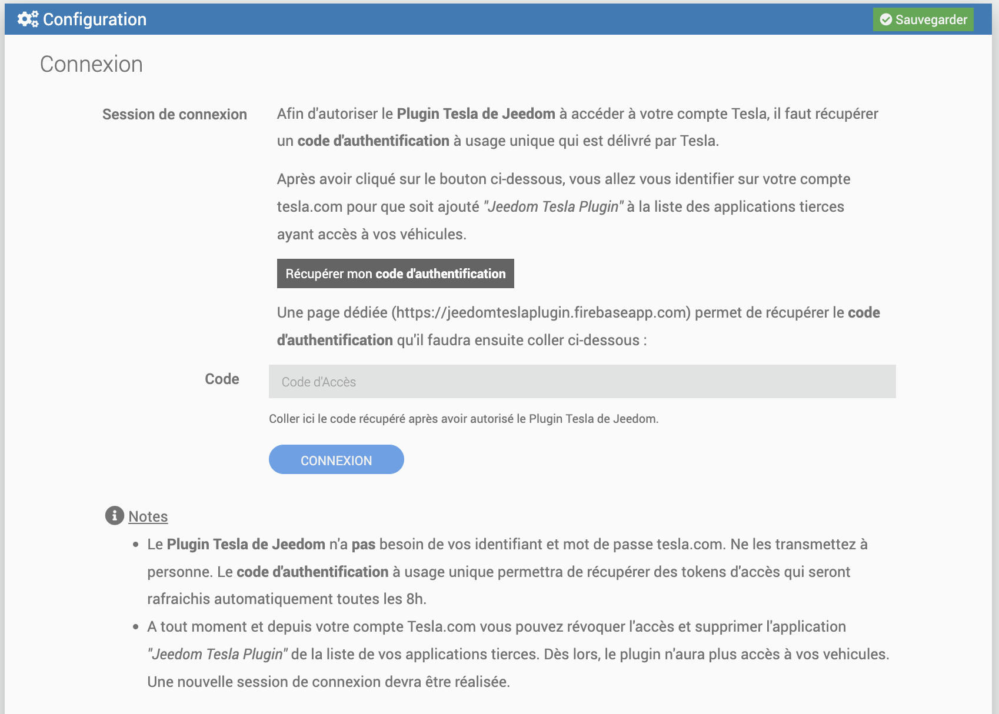
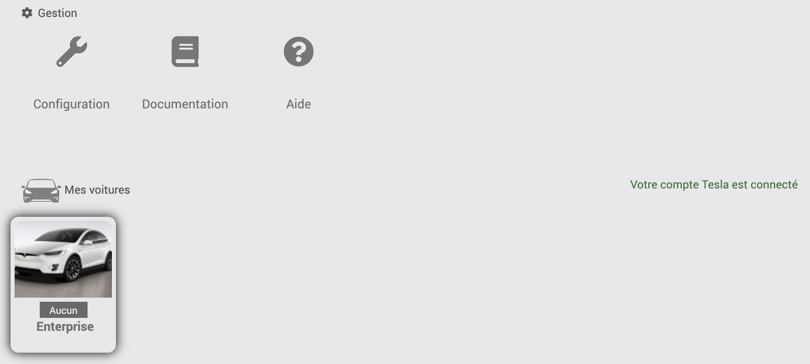
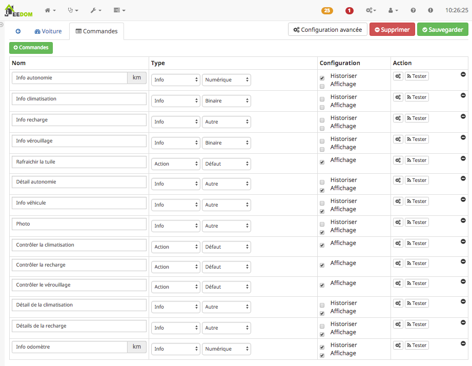

Introduction
===
Bienvenue sur la page de documentation du plugin Jeedom Tesla ! 

Avec ce plugin, l'utilisateur peut accéder à sa voiture Tesla, et intéragir avec les données remontées par l'API proposée par Tesla.

Configuration du plugin
=======================

La configuration est très simple, après téléchargement du plugin, il
vous suffit de l’activer et d'utiliser l'une des deux méthodes indiquées ci-dessous pour accéder à votre compte Tesla.


Le plugin va rechercher la ou les Tesla associées à votre compte et créer les équipements automatiquement.


> **Tip**
>
> Ce plugin nécessite que votre Tesla soit accessible sur le réseau pour ne pas provoquer d'erreur. 
> Si l'application Tesla sur votre smartphone arrive à se connecter à votre Tesla, le plugin sera à même de configurer correctement votre Tesla dans Jeedom.


Les deux méthodes de connections sont les suivantes:

### 1) Avec vos identifiants de compte Tesla:

- **Email** : l'email que vous utilisez pour vos connecter sur votre compte Tesla
- **Mot de passe** : le mot de passe correspondant
> **Note**
>
> Vos identifiants ne sont utilisés que lors de la phase de connexion pour récupérer un jeton d'accès. 
> 
> De part la nature de Jeedom qui est Self Hosted, vos identifiants sont stockés **localement** sur la machine qui héberge votre Jeedom. Malgré tout, si vous le souhaitez, vous pourriez après la première synchronisation, effacer les champs email/mot de passe.
>
> Néanmoins, le jeton d'accès a une date d'expiration (environ 90 jours) au dela de laquelle il tentera de refaire une connection pour le rafraichir. Il vous appartiendra de remettre vos identifiants et/ou coller un jeton d'accès (cf methode n°2)

### 2) Avec un jeton d'accès:

- **Jeton d'accès** : Jeton que vous pouvez, entre autre, vous procurer en executant le script php fourni avec le plugin:

```
$ php /var/www/html/plugins/tesla/scripts/tokenTesla.php mon.email@FAI.fr mot2passe

Votre jeton d'accès à votre compte Tesla : 49329effb7d381c945fbf7e6b3e02691e746904f47ebdb2a3e54d49c93473e80
```

> **Note**
>
> Cette méthode permet d'éviter d'entrer ses identifiants dans la configuration du plugin.
> Le plugin ne fonctionnera que pendant la durée de validité du jeton d'accès. 
> Un bouton `revoker mon jeton d'accès` permet d'informer le service Tesla que ce jeton ne permettra plus la connexion au service.

Le bouton __"Synchroniser mes voitures"__ permettra d'effectuer la recherche et ajoutera un équipement Jeedom pour chaque véhicule Tesla non encore créé.

Tesla virtuelle
--

Pour tester le plugin sans connexion à votre compte Tesla, ou si vous n'avez pas (encore) de Tesla, le plugin offre la possibilité de créer des équipements virtuels correspondants à des Tesla __Model S__ et/ou __Model X__.

Il suffira de cliquer sur le bouton __"Ajouter des Tesla virtuelles"__. Des jeux de données correspondants à des véhicules réels seront utilisés pour créer des équipements virtuels. Bien entendu toute action (chauffage/charge/dévérouillage) sur ces équipements sera sans effet.

Autres paramètres de configuration
--

- **Coût du kWh** (en euro) : Nécessaire pour calculer approximativement le cout d'une charge, le prix pour parcourir 100km et le nombre de km que l'on peut faire avec 1 euro. La valeur par défaut est `0.14`.
- **Tesla Client ID** et **Tesla Client Secret** : deux clefs publiques qui sont necessaires pour accéder à l'API du serveur des Tesla. Déjà renseignées, ces clefs peuvent être modifiées au cas où l'API requiert de nouvelles valeurs. 


Configuration du véhicule
=======================

Une fois le plugin configuré, le ou les véhicules de votre compte tesla sont ajoutés. Il suffit de cliquer sur chacun pour l'activer, le rendre visible et l'attacher à un objet parent (ici le Garage) :




Les commandes d'info et d'action associées à chaque Tesla sont les suivantes



Commandes de type **info**
--

| Commande   |   Description |
| --- | --- |
| **Photo** | affiche une photo de la Tesla.
| **Info autonomie** | indique l'autonomie en km de la voiture.
| **Info climatisation** | indique si la climatisation est allumée ou éteinte.
| **Info recharge** | indique si la voiture est en train de charger ou non. Les valeurs possibles sont  { `Charging`, `Stopped`, `Disconnected`, `Complete`, `Scheduled` }.
| **Info verouillage** | indique si la voiture est fermée ou ouverte.
| **Odomètre** | indique la valeur du compteur kilométrique.
| **Info véhicule** | affiche un titre et un sous titre correspondant à l'état actuel de la voiture. Par exemple _Conduite 67km_, _Recharge programmée à 22h50_, _Stationnée_, _Supercharge_, ...
| **Détail autonomie** | affiche un graph de la batterie
| **Détail de la recharge** | affiche les données issues de la recharge.
| **Détail de la climatisation** | affiche les paramètres de climatisation (conducteur, passager, intérieur et extérieur). 

Commandes de type **action**
--

| Commande   |   Description |
| --- | --- |
| **Contrôler la recharge** | Va permettre de démarrer ou interrompre la charge si le cable de recharge est engagé.
| **Contrôler la climatisation** | Va permettre d'allumer ou d'arreter la climatisation.
| **Contrôler le vérouillage** | Va permettre de vérouiller ou déverouiller la voiture.
| **Rafraichir** | Mise à jour de la tuile sur clic de l'icone.


Affichage du véhicule
=======================

La plupart des commandes listées ci-dessus a un template spécifique qui lui est attribué, et qui permet d'obtenir par défaut l'affichage d'un véhicule tel qu'illustré sur l'image:


Par exemple pour ne pas afficher la photo et les détails de climatisation, il suffit pour un véhicule donné de décocher `"Affichage"` dans la ligne correspondante de la configuration de ces commandes.

L'odomètre est historisé, ce qui permet d'obtenir le graphique des km parcourus.

Contrôler la climatisation
--

| Bouton | Description | Un clic sur ce bouton va ... | 
| --- | --- | --: |
|  | La climatisation est éteinte | _... allumer la climatisation_ | 
|  | La climatisation est allumée | _... éteindre la climatisation_ |


Contrôler le vérouillage
--

| Bouton | Description |  Un clic sur ce bouton va ... |
| --- | --- | --: |
|  | La voiture est fermée | _... dévérouiller les portes_ |
|  | La voiture est ouverte | _... vérouiller les portes_ |

Contrôler la charge
--

| Bouton | Description |  Un clic sur ce bouton va ... |
| --- | --- | ---: |
|  | Le cable de charge n'est pas engagé | _... être sans effet_
|  | La recharge est programéee | _... démarrer la recharge_
|  | La recharge est en cours | _... stopper la recharge_
|  | La recharge a été manuellement arrétée | _... reprendre la recharge_
|  | La recharge est terminée | ... _être sans effet_
|  | Etat de recharge indéterminée | ... _être sans effet_
 


FAQ:
==

Merci d'envoyer toute question à <a href='mailto:vercors.io@gmail.com?subject=About%20Jeedom%20Tesla%20plugin...'>vercors.io@gmail.com</a> !
